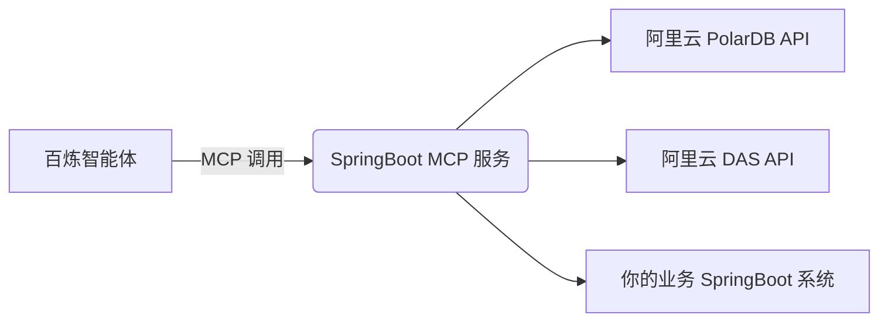

太好了！你使用 **Java**，我们可以用 **Spring Boot** 快速构建一个符合阿里云 MCP 协议的智能体工具服务，并完整实现你提出的 4 个功能：

> ✅ 1. 获取慢日志  
> ✅ 2. 发起 DAS 诊断  
> ✅ 3. 获取优化建议  
> ✅ 4. 推送结果到你的业务系统

---

## 🧱 整体架构（Java 版）



我们将开发一个 **独立的 Spring Boot 应用** 作为 **MCP 工具服务**，部署在 ECS 或 Serverless。

---

## 第一步：创建 Spring Boot MCP 服务项目

### 1. Maven 依赖 (`pom.xml`)
```xml
<dependencies>
    <!-- Web -->
    <dependency>
        <groupId>org.springframework.boot</groupId>
        <artifactId>spring-boot-starter-web</artifactId>
    </dependency>

    <!-- 阿里云 SDK -->
    <dependency>
        <groupId>com.aliyun</groupId>
        <artifactId>aliyun-java-sdk-core</artifactId>
        <version>4.6.3</version>
    </dependency>
    <dependency>
        <groupId>com.aliyun</groupId>
        <artifactId>aliyun-java-sdk-polardb</artifactId>
        <version>2.0.15</version>
    </dependency>
    <dependency>
        <groupId>com.aliyun</groupId>
        <artifactId>aliyun-java-sdk-das</artifactId>
        <version>2.0.19</version>
    </dependency>

    <!-- HTTP Client (用于推送) -->
    <dependency>
        <groupId>org.apache.httpcomponents</groupId>
        <artifactId>httpclient</artifactId>
    </dependency>

    <!-- Lombok (可选) -->
    <dependency>
        <groupId>org.projectlombok</groupId>
        <artifactId>lombok</artifactId>
        <optional>true</optional>
    </dependency>
</dependencies>
```

---

## 第二步：配置阿里云凭证

### `application.yml`
```yaml
aliyun:
  access-key-id: ${ALIYUN_ACCESS_KEY_ID}      # 建议通过环境变量传入
  access-key-secret: ${ALIYUN_ACCESS_KEY_SECRET}
  region-id: cn-shanghai                      # 根据你的实例区域调整

mcp:
  target-springboot-url: http://your-business-app.com/api/dba/slowsql-advice
```

> 🔒 **安全提示**：不要将 AK/SK 写死在代码中！使用环境变量或 Secrets Manager。

---

## 第三步：定义数据模型

### `SlowLogRecord.java`
```java
@Data
public class SlowLogRecord {
    private String sqlId;
    private String sqlText;
    private Long executionTime;
    private String dbName;
}
```

### `DiagnosisResult.java`
```java
@Data
public class DiagnosisResult {
    private String originalSql;
    private String optimizedSql;
    private String indexAdvice;
    private String performanceGain; // e.g., "85%"
}
```

### `FinalAdvicePayload.java`（推送给业务系统的格式）
```java
@Data
public class FinalAdvicePayload {
    private String instanceId;
    private String sqlId;
    private String originalSql;
    private String optimizedSql;
    private String indexAdvice;
    private String performanceGain;
    private LocalDateTime createTime = LocalDateTime.now();
}
```

---

## 第四步：核心服务类（调用阿里云 API）

### `AliyunDbService.java`
```java
@Service
@Slf4j
public class AliyunDbService {

    @Value("${aliyun.access-key-id}")
    private String accessKeyId;

    @Value("${aliyun.access-key-secret}")
    private String accessKeySecret;

    @Value("${aliyun.region-id}")
    private String regionId;

    /**
     * 1. 获取慢日志
     */
    public List<SlowLogRecord> getSlowLogs(String instanceId, String startTime, String endTime) {
        DefaultProfile profile = DefaultProfile.getProfile(regionId, accessKeyId, accessKeySecret);
        IAcsClient client = new DefaultAcsClient(profile);

        DescribeSlowLogRecordsRequest request = new DescribeSlowLogRecordsRequest();
        request.setDBInstanceId(instanceId);
        request.setStartTime(startTime); // 格式: yyyy-MM-dd'T'HH:mmZ
        request.setEndTime(endTime);
        request.setPageSize(3); // 只取前3条最慢的

        try {
            DescribeSlowLogRecordsResponse response = client.getAcsResponse(request);
            return response.getItems().stream()
                .map(item -> {
                    SlowLogRecord record = new SlowLogRecord();
                    record.setSqlId(item.getSQLId());
                    record.setSqlText(item.getSQLText());
                    record.setExecutionTime(item.getExecutionTime());
                    record.setDbName(item.getDBName());
                    return record;
                })
                .sorted((a, b) -> Long.compare(b.getExecutionTime(), a.getExecutionTime()))
                .collect(Collectors.toList());
        } catch (Exception e) {
            log.error("获取慢日志失败", e);
            throw new RuntimeException("获取慢日志失败: " + e.getMessage());
        }
    }

    /**
     * 2. 发起诊断
     */
    public String createDiagnosis(String instanceId, String sqlId) {
        DefaultProfile profile = DefaultProfile.getProfile(regionId, accessKeyId, accessKeySecret);
        IAcsClient client = new DefaultAcsClient(profile);

        CreateRequestDiagnosisRequest request = new CreateRequestDiagnosisRequest();
        request.setInstanceId(instanceId);
        request.setSqlId(sqlId);

        try {
            CreateRequestDiagnosisResponse response = client.getAcsResponse(request);
            return response.getMessageId(); // 用于后续查询结果
        } catch (Exception e) {
            log.error("发起诊断失败", e);
            throw new RuntimeException("发起诊断失败: " + e.getMessage());
        }
    }

    /**
     * 3. 获取诊断结果
     */
    public DiagnosisResult getDiagnosisResult(String messageId) {
        DefaultProfile profile = DefaultProfile.getProfile(regionId, accessKeyId, accessKeySecret);
        IAcsClient client = new DefaultAcsClient(profile);

        GetRequestDiagnosisResultRequest request = new GetRequestDiagnosisResultRequest();
        request.setMessageId(messageId);

        try {
            GetRequestDiagnosisResultResponse response = client.getAcsResponse(request);
            // 注意：DAS 返回的是 JSON 字符串，需解析
            String resultJson = response.getResult();
            JSONObject json = JSON.parseObject(resultJson);

            DiagnosisResult result = new DiagnosisResult();
            result.setOriginalSql(json.getString("originalSql"));
            result.setOptimizedSql(json.getString("optimizedSql"));
            result.setIndexAdvice(json.getString("indexAdvice"));
            result.setPerformanceGain(json.getString("performanceGain"));

            return result;
        } catch (Exception e) {
            log.error("获取诊断结果失败", e);
            throw new RuntimeException("获取诊断结果失败: " + e.getMessage());
        }
    }
}
```

---

## 第五步：MCP Controller（供百炼调用）

### `McpController.java`
```java
@RestController
@RequestMapping("/mcp")
@Slf4j
public class McpController {

    @Autowired
    private AliyunDbService aliyunDbService;

    @Value("${mcp.target-springboot-url}")
    private String targetUrl;

    /**
     * 1. 查询慢日志
     */
    @PostMapping("/describe_slow_logs")
    public ResponseEntity<?> describeSlowLogs(@RequestBody Map<String, String> request) {
        String instanceId = request.get("instance_id");
        String startTime = request.get("start_time");
        String endTime = request.get("end_time");

        List<SlowLogRecord> records = aliyunDbService.getSlowLogs(instanceId, startTime, endTime);
        return ResponseEntity.ok(records);
    }

    /**
     * 2. 发起诊断
     */
    @PostMapping("/create_diagnosis")
    public ResponseEntity<?> createDiagnosis(@RequestBody Map<String, String> request) {
        String instanceId = request.get("instance_id");
        String sqlId = request.get("sql_id");

        String messageId = aliyunDbService.createDiagnosis(instanceId, sqlId);
        return ResponseEntity.ok(Map.of("message_id", messageId));
    }

    /**
     * 3. 获取诊断结果
     */
    @PostMapping("/get_diagnosis_result")
    public ResponseEntity<?> getDiagnosisResult(@RequestBody Map<String, String> request) {
        String messageId = request.get("message_id");
        DiagnosisResult result = aliyunDbService.getDiagnosisResult(messageId);
        return ResponseEntity.ok(result);
    }

    /**
     * 4. 推送最终结果到业务系统
     */
    @PostMapping("/push_to_springboot")
    public ResponseEntity<?> pushToSpringBoot(@RequestBody FinalAdvicePayload payload) {
        try {
            // 使用 HttpClient 发送 POST 请求
            CloseableHttpClient httpClient = HttpClients.createDefault();
            HttpPost httpPost = new HttpPost(targetUrl);
            httpPost.setHeader("Content-Type", "application/json");

            String json = JSON.toJSONString(payload);
            httpPost.setEntity(new StringEntity(json, ContentType.APPLICATION_JSON));

            CloseableHttpResponse response = httpClient.execute(httpPost);
            int statusCode = response.getStatusLine().getStatusCode();
            httpClient.close();

            if (statusCode >= 200 && statusCode < 300) {
                log.info("成功推送优化建议到业务系统: {}", payload.getSqlId());
                return ResponseEntity.ok(Map.of("status", "success"));
            } else {
                throw new RuntimeException("业务系统返回错误状态码: " + statusCode);
            }
        } catch (Exception e) {
            log.error("推送失败", e);
            return ResponseEntity.status(500).body(Map.of("error", e.getMessage()));
        }
    }
}
```

---

## 第六步：部署与集成

### 1. 打包应用
```bash
mvn clean package
```

### 2. 启动（通过环境变量传入敏感信息）
```bash
java -jar mcp-service.jar \
  --aliyun.access-key-id=YOUR_AK \
  --aliyun.access-key-secret=YOUR_SK \
  --mcp.target-springboot-url=http://your-business-app.com/api/dba/slowsql-advice
```

### 3. 在百炼中注册 MCP
- 服务地址：`http://your-mcp-server:8080/mcp`
- 工具路径：
  - `describe_slow_logs` → POST `/describe_slow_logs`
  - `create_diagnosis` → POST `/create_diagnosis`
  - `get_diagnosis_result` → POST `/get_diagnosis_result`
  - `push_to_springboot` → POST `/push_to_springboot`

---

## 第七步：你的业务系统接收接口（示例）

确保你的主 Spring Boot 应用有如下接口：

```java
@PostMapping("/api/dba/slowsql-advice")
public ResponseEntity<?> receiveAdvice(@RequestBody FinalAdvicePayload payload) {
    // 保存到数据库 / 发送通知 / 触发工单等
    log.info("收到DAS优化建议: {}", payload.getSqlId());
    return ResponseEntity.ok().build();
}
```

---

## ✅ 最终效果

当你在百炼中对智能体说：
> “分析实例 pc-xxx 在过去24小时的慢SQL”

智能体会自动：
1. 调用 `describe_slow_logs` → 获取3条最慢SQL
2. 对每条 SQL：
   - 调用 `create_diagnosis`
   - 调用 `get_diagnosis_result`
3. 将结构化结果通过 `push_to_springboot` 推送到你的系统

---

## 🔒 安全与生产建议

1. **AK/SK 管理**  
   - 使用 **ECS RAM 角色** 替代 AK/SK（更安全）
   - 或通过 **KMS/Secrets Manager** 加密

2. **重试机制**  
   - DAS 诊断可能需要几秒，可在 `getDiagnosisResult` 中加轮询

3. **限流**  
   - 阿里云 API 有 QPS 限制，避免并发过高

4. **日志监控**  
   - 记录每次调用，便于审计

---

## 🚀 下一步

1. 先本地测试三个阿里云 API 是否能调通
2. 部署这个 MCP 服务到测试环境
3. 在百炼中注册并测试

如果你需要：
- **完整的 GitHub 项目模板**
- **Dockerfile 部署脚本**
- **百炼 System Prompt 示例**

请告诉我，我可以立即提供！