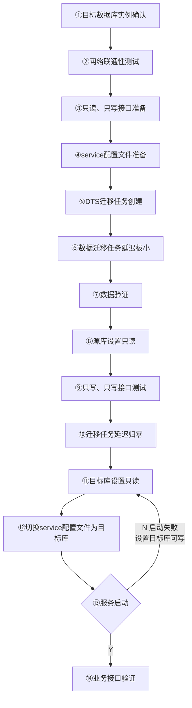

```mermaid
graph TD
%% 左侧准备阶段
A[①目标数据库实例确认] --> B[②网络联通性测试]
B --> C[③只读、只写接口准备]
C --> D[④service配置文件准备]
%% 中间任务创建与执行
D --> E[⑤DTS迁移任务创建]
E --> F[⑥数据迁移任务延迟极小]
F --> G[⑦数据验证]
G --> H[⑧源库设置只读]
H --> I[⑨只写、只写接口测试]
I --> J[⑩迁移任务延迟归零]
J --> K[⑪目标库设置只读]
%% 右侧服务切换与验证
K --> L[⑫切换service配置文件为目标库]
L --> M{⑬服务启动}
M -->|Y| N[⑭业务接口验证]
M -->|N 启动失败<br>设置目标库可写| K
%% 辅助连接线
```

