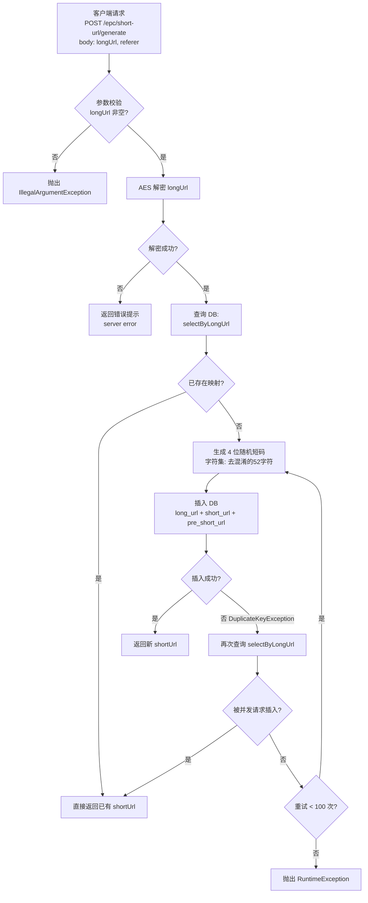
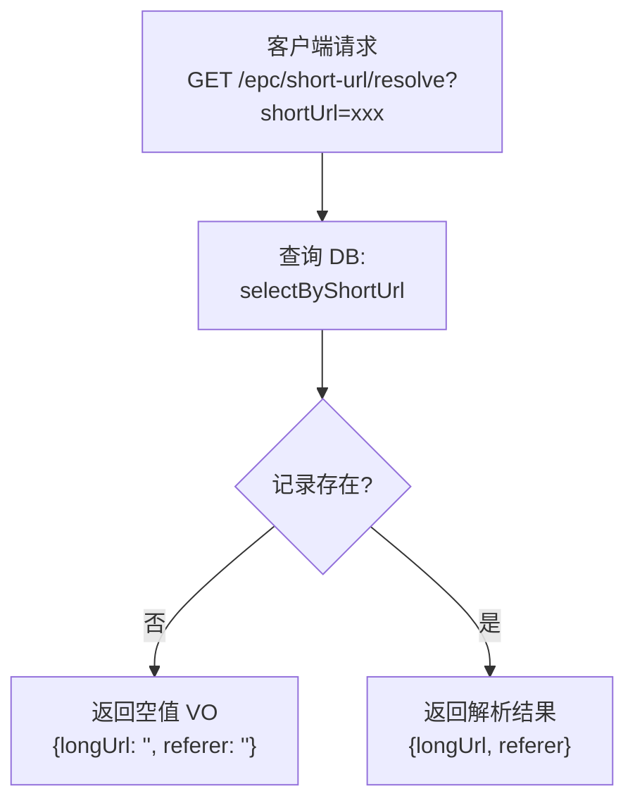

## 入口

``

## 生成短连接

```mermaid
flowchart TD                                                                                                          
      A[客户端请求<br>POST /epc/short-url/generate<br>body: longUrl, referer] --> B{参数校验<br>longUrl 非空?}        
      B -->|否| B1[抛出 IllegalArgumentException]                                                                       
      B --> |是| C[AES 解密 longUrl]
      C --> D{解密成功?}                                                                                                
      D -->|否| D1[返回错误提示<br>server error]                                                                      
      D -->|是| E[查询 DB:<br>selectByLongUrl]                                                                          
      E --> F{已存在映射?}                                                                                              
      F -->|是| G[直接返回已有 shortUrl]                                                                                
      F -->|否| H[生成 4 位随机短码<br>字符集: 去混淆的52字符]                                                          
      H --> I[插入 DB<br>long_url + short_url + pre_short_url]                                                          
      I --> J{插入成功?}                                                                                                
      J -->|是| K[返回新 shortUrl]                                                                                      
      J -->|否 DuplicateKeyException| L[再次查询 selectByLongUrl]                                                       
      L --> M{被并发请求插入?}                                                                                          
      M -->|是| G                                                                                                       
      M -->|否| N{重试 < 100 次?}                                                                                       
      N -->|是| H                                                                                                       
      N -->|否| O[抛出 RuntimeException]

```

## 解析短连接

```mermaid
  flowchart TD    
      A[客户端请求<br>GET /epc/short-url/resolve?shortUrl=xxx] --> B[查询 DB:<br>selectByShortUrl]
      B --> C{记录存在?}                                                                                                
      C -->|否| D["返回空值 VO<br>{longUrl: '', referer: ''}"]                                                          
      C -->|是| E["返回解析结果<br>{longUrl, referer}"] 
```
