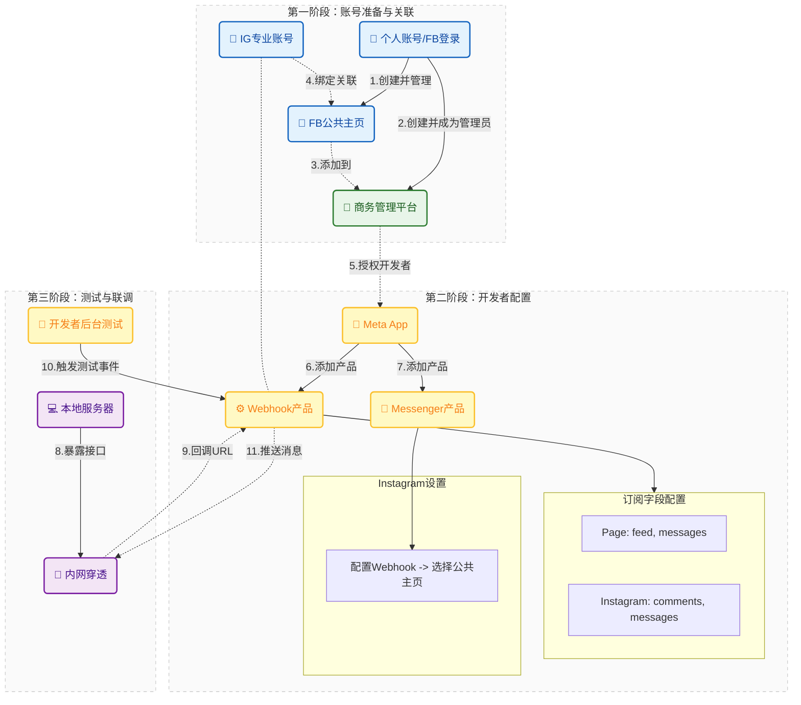

### 第一阶段

`账号准备阶段`

- 创建facebook个人账号（也是开发者账号 此时是个人账号使用`facebook.com`登录 也可以使用个人账号登录meta开发者后台`developers.meta.com`）
- 使用个人账号创建facebook公共主页（个人账号成为公共主页管理员）
- 创建业务账号（`business.facebook.com`）相当于公司账号 这时候个人账号成为了管理员
- 将公共主页的添加到业务账号中
- 创建或者使用facebook登录instagram账号（此时instagram是**个人账号**）
- 将instagram转为**专业账号**
- 将该instagram**专业账号**绑定到facebook公共主页
- 可以使用业务账号授权给开发为管理员或者开发者（或者直接使用这个个人账号在meta开发者后台授权给开发为管理员或者开发者）

### 第二阶段

`开发者准备阶段`

- 开发获得meta开发后台的权限之后创建app
- 选择产品`webhook`
	- 选择对应的的需要订阅的内容
		- Page --> 公共主页相关
			- feed
			- messages
		- Instagram --> Instagram专业账户相关
			- comments
			- messages
- 选择产品`Messenger`
	- Instagram设置
		- 配置webhook
			- 选择对应的公共主页
			- 选择对应的订阅字段

### 第三阶段

`测试webhook回调`

- 本地可以使用内网穿透工具将http代理到本地
- 写好回调的接口
- meta开发者后台调用测试事件
	- facebook公共主页的消息
	- Instagram专业账号的消息

> [!NOTE] 注意
> 在mata开发者后台测试webhook回调发送事件的时候，如果回调事件没有发送需要将应用改成上线模式
> 

