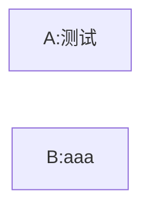

## 需要的数据

| 数据         | 数据位置 | 说明                           |     |
| ---------- | ---- | ---------------------------- | --- |
| prompt     | 文档中  | prompt已经写好，调试效果后观察是否需要改动     |     |
| 工单上下文      | 后端   | 当前工单历史回复                     |     |
| 当前工单订单信息   | 后端   | 订单的产品信息（sku、店铺、渠道）工单上一般会带有   |     |
| 产品信息       | 后端   | 当前工单回复中是否包含，或者后端反查           |     |
| 当前工单附件     | 后端   | 单独拿出来是因为附件格式不一样，可能是图片文件等     |     |
| 渠道政策       | 谁提供？ | 各个订单平台的规则性文件 ==后台运营或者产品配置？== |     |
| AGENT_AUTH |      |                              |     |
|            |      |                              |     |
## 触发agent审核时机

1. aboss用户按钮点击
2. 保存草稿之后后端触发审核

