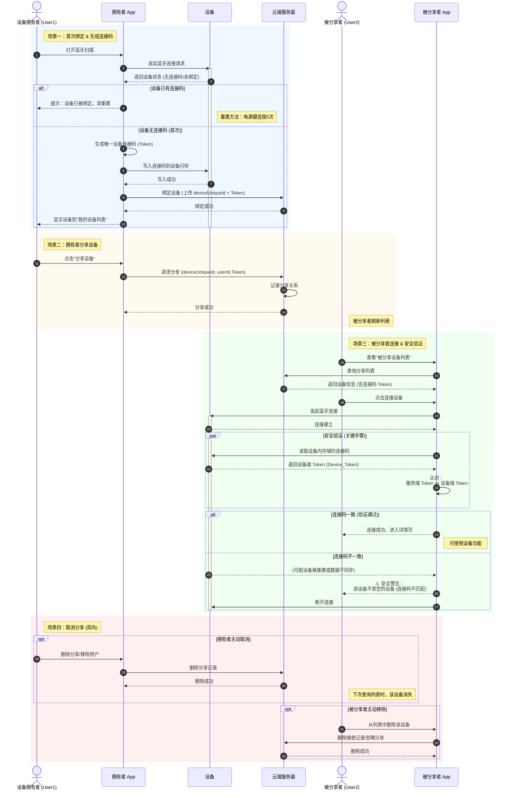

```mermaid
sequenceDiagram
    autonumber
    actor Owner as 设备拥有者 (User1)
    participant App1 as 拥有者 App
    participant Device as 设备
    participant Server as 云端服务器
    actor Guest as 被分享者 (User2)
    participant App2 as 被分享者 App

    %% ================= 场景一：首次绑定与码生成 =================
    rect rgb(240, 248, 255)
        note right of Owner: 场景一：首次绑定 & 生成连接码
        Owner->>App1: 打开蓝牙扫描
        App1->>Device: 发起蓝牙连接请求
        activate Device
        Device-->>App1: 返回设备状态 (无连接码/未绑定)
        
        alt 设备已有连接码
            App1-->>Owner: 提示：设备已被绑定，请重置
            Note right of Device: 重置方法：电源键连按5次
        else 设备无连接码 (首次)
            App1->>App1: 生成唯一设备连接码 (Token)
            App1->>Device: 写入连接码到设备闪存
            Device-->>App1: 写入成功
            App1->>Server: 绑定设备 (上传 deviceUniqueId + Token)
            Server-->>App1: 绑定成功
            App1-->>Owner: 显示设备到"我的设备列表"
        end
        deactivate Device
    end

    %% ================= 场景二：分享设备 =================
    rect rgb(255, 250, 240)
        note right of Owner: 场景二：拥有者分享设备
        Owner->>App1: 点击"分享设备"
        App1->>Server: 请求分享 (deviceUniqueId, userId,Token)
        Server->>Server: 记录分享关系
        Server-->>App1: 分享成功
        Note right of Guest: 被分享者刷新列表
    end

    %% ================= 场景三：被分享者连接与验证 =================
    rect rgb(240, 255, 240)
        note right of Guest: 场景三：被分享者连接 & 安全验证
        
        Guest->>App2: 查看"被分享设备列表"
        App2->>Server: 查询分享列表
        Server-->>App2: 返回设备信息 (含连接码 Token)
        
        Guest->>App2: 点击连接设备
        App2->>Device: 发起蓝牙连接
        activate Device
        Device-->>App2: 连接建立
        
        par 安全验证 (关键步骤)
            App2->>Device: 读取设备内存储的连接码
            Device-->>App2: 返回设备端 Token (Device_Token)
            App2->>App2: 比对：<br/>服务端 Token vs 设备端 Token
        end
        
        alt 连接码一致 (验证通过)
            App2-->>Guest: 连接成功，进入详情页
            Note right of App2: 可使用设备功能
        else 连接码不一致
            Device-->>App2: (可能设备被重置或数据不同步)
            App2-->>Guest: ⚠️ 安全警告：<br/>该设备不是您的设备 (连接码不匹配)
            App2->>Device: 断开连接
        end
        deactivate Device
    end

    %% ================= 场景四：取消分享 =================
    rect rgb(255, 240, 240)
        note right of Owner: 场景四：取消分享 (双向)
        
        opt 拥有者主动取消
            Owner->>App1: 删除分享/移除用户
            App1->>Server: 删除分享记录
            Server-->>App1: 删除成功
            Note right of Guest: 下次查询列表时，该设备消失
        end

        opt 被分享者主动移除
            Guest->>App2: 从列表中删除该设备
            App2->>Server: 删除接收记录/忽略分享
            Server-->>App2: 删除成功
        end
    end
```

