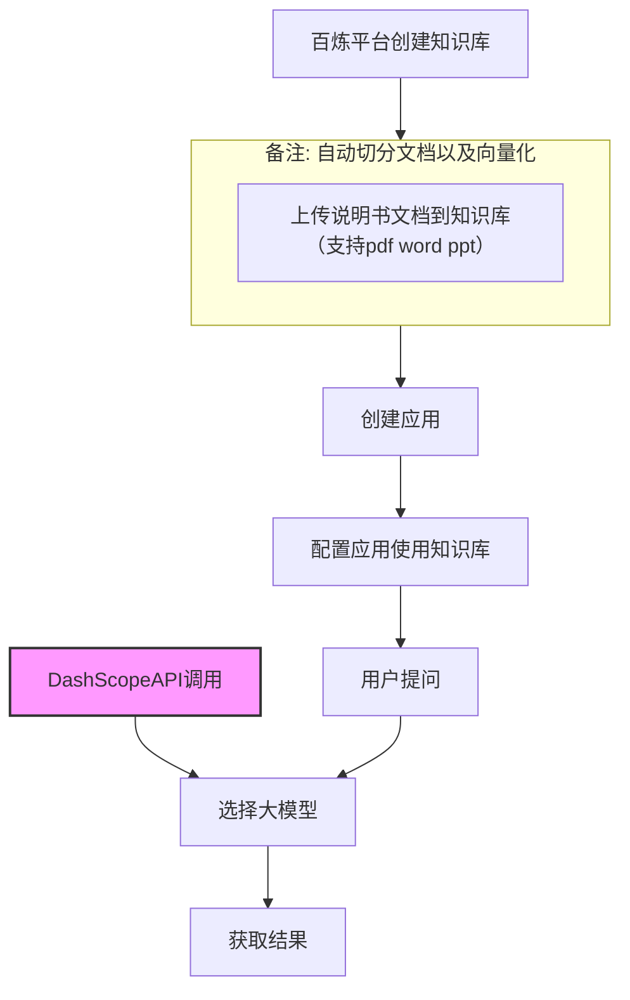

## 流程



通过api 我们需要再DashScopeAPI处理

- 从控制台获取apikey
- 配置到环境变量（推荐，**禁止明文**）


这里验证的是curl方案

具体代码见
[DashScopeAPI文档](https://bailian.console.aliyun.com/cn-beijing?spm=5176.12818093_47.console-base_product-drawer-right.dproducts-and-services-sfm.3be916d0TFccNR&tab=doc#/doc/?type=app&url=2881515)

模板
```shell
curl --location 'https://dashscope.aliyuncs.com/api/v1/apps/${appId}/completion' \
--header 'Authorization: Bearer ${sk}' \
--header 'Content-Type: application/json' \
--header 'X-DashScope-SSE: enable' \
--data '{
    "input": {
        "prompt": "X10的后面板有什么接口"
    },
    "parameters":  {
        "incremental_output":true
    },
    "debug": {}
}'
```

标准请求
```shell
curl --location 'https://dashscope.aliyuncs.com/api/v1/apps/xxxx/completion' \
--header 'Authorization: Bearer sk-xxxx' \
--header 'Content-Type: application/json' \
--header 'X-DashScope-SSE: enable' \
--data '{
    "input": {
        "prompt": "X10的后面板有什么接口"
    },
    "parameters":  {
        "incremental_output":true
    },
    "debug": {}
}'
```


响应示例(流式)：

```json
id:1
event:result
:HTTP_STATUS/200
data:{"output":{"session_id":"7487614168b445b49049a89e3b55ac48","finish_reason":"null","text":"","reject_status":false},"usage":{"models":[{"input_tokens":2323,"output_tokens":9,"model_id":"qwen3.5-plus"}]},"request_id":"7b5ee80d-e24f-411e-86e0-4f1038a1f69e"}

id:2
event:result
:HTTP_STATUS/200
data:{"output":{"session_id":"7487614168b445b49049a89e3b55ac48","finish_reason":"null","text":"","reject_status":false},"usage":{"models":[{"input_tokens":2323,"output_tokens":12,"model_id":"qwen3.5-plus"}]},"request_id":"7b5ee80d-e24f-411e-86e0-4f1038a1f69e"}

id:3
event:result
:HTTP_STATUS/200
data:{"output":{"session_id":"7487614168b445b49049a89e3b55ac48","finish_reason":"null","text":"","reject_status":false},"usage":{"models":[{"input_tokens":2323,"output_tokens":26,"model_id":"qwen3.5-plus"}]},"request_id":"7b5ee80d-e24f-411e-86e0-4f1038a1f69e"}

id:4
event:result
:HTTP_STATUS/200
data:{"output":{"session_id":"7487614168b445b49049a89e3b55ac48","finish_reason":"null","text":"","reject_status":false},"usage":{"models":[{"input_tokens":2323,"output_tokens":30,"model_id":"qwen3.5-plus"}]},"request_id":"7b5ee80d-e24f-411e-86e0-4f1038a1f69e"}

id:5
event:result
:HTTP_STATUS/200
data:{"output":{"session_id":"7487614168b445b49049a89e3b55ac48","finish_reason":"null","text":"","reject_status":false},"usage":{"models":[{"input_tokens":2323,"output_tokens":43,"model_id":"qwen3.5-plus"}]},"request_id":"7b5ee80d-e24f-411e-86e0-4f1038a1f69e"}

id:6
event:result
:HTTP_STATUS/200
data:{"output":{"session_id":"7487614168b445b49049a89e3b55ac48","finish_reason":"null","text":"","reject_status":false},"usage":{"models":[{"input_tokens":2323,"output_tokens":44,"model_id":"qwen3.5-plus"}]},"request_id":"7b5ee80d-e24f-411e-86e0-4f1038a1f69e"}

id:7
event:result
:HTTP_STATUS/200
data:{"output":{"session_id":"7487614168b445b49049a89e3b55ac48","finish_reason":"null","text":"","reject_status":false},"usage":{"models":[{"input_tokens":2323,"output_tokens":57,"model_id":"qwen3.5-plus"}]},"request_id":"7b5ee80d-e24f-411e-86e0-4f1038a1f69e"}

id:8
event:result
:HTTP_STATUS/200
data:{"output":{"session_id":"7487614168b445b49049a89e3b55ac48","finish_reason":"null","text":"","reject_status":false},"usage":{"models":[{"input_tokens":2323,"output_tokens":61,"model_id":"qwen3.5-plus"}]},"request_id":"7b5ee80d-e24f-411e-86e0-4f1038a1f69e"}

id:9
event:result
:HTTP_STATUS/200
data:{"output":{"session_id":"7487614168b445b49049a89e3b55ac48","finish_reason":"null","text":"","reject_status":false},"usage":{"models":[{"input_tokens":2323,"output_tokens":77,"model_id":"qwen3.5-plus"}]},"request_id":"7b5ee80d-e24f-411e-86e0-4f1038a1f69e"}

id:10
event:result
:HTTP_STATUS/200
data:{"output":{"session_id":"7487614168b445b49049a89e3b55ac48","finish_reason":"null","text":"","reject_status":false},"usage":{"models":[{"input_tokens":2323,"output_tokens":81,"model_id":"qwen3.5-plus"}]},"request_id":"7b5ee80d-e24f-411e-86e0-4f1038a1f69e"}

id:11
event:result
:HTTP_STATUS/200
data:{"output":{"session_id":"7487614168b445b49049a89e3b55ac48","finish_reason":"null","text":"","reject_status":false},"usage":{"models":[{"input_tokens":2323,"output_tokens":97,"model_id":"qwen3.5-plus"}]},"request_id":"7b5ee80d-e24f-411e-86e0-4f1038a1f69e"}

id:12
event:result
:HTTP_STATUS/200
data:{"output":{"session_id":"7487614168b445b49049a89e3b55ac48","finish_reason":"null","text":"","reject_status":false},"usage":{"models":[{"input_tokens":2323,"output_tokens":101,"model_id":"qwen3.5-plus"}]},"request_id":"7b5ee80d-e24f-411e-86e0-4f1038a1f69e"}

id:13
event:result
:HTTP_STATUS/200
data:{"output":{"session_id":"7487614168b445b49049a89e3b55ac48","finish_reason":"null","text":"","reject_status":false},"usage":{"models":[{"input_tokens":2323,"output_tokens":116,"model_id":"qwen3.5-plus"}]},"request_id":"7b5ee80d-e24f-411e-86e0-4f1038a1f69e"}

id:14
event:result
:HTTP_STATUS/200
data:{"output":{"session_id":"7487614168b445b49049a89e3b55ac48","finish_reason":"null","text":"","reject_status":false},"usage":{"models":[{"input_tokens":2323,"output_tokens":119,"model_id":"qwen3.5-plus"}]},"request_id":"7b5ee80d-e24f-411e-86e0-4f1038a1f69e"}

id:15
event:result
:HTTP_STATUS/200
data:{"output":{"session_id":"7487614168b445b49049a89e3b55ac48","finish_reason":"null","text":"","reject_status":false},"usage":{"models":[{"input_tokens":2323,"output_tokens":133,"model_id":"qwen3.5-plus"}]},"request_id":"7b5ee80d-e24f-411e-86e0-4f1038a1f69e"}

id:16
event:result
:HTTP_STATUS/200
data:{"output":{"session_id":"7487614168b445b49049a89e3b55ac48","finish_reason":"null","text":"","reject_status":false},"usage":{"models":[{"input_tokens":2323,"output_tokens":137,"model_id":"qwen3.5-plus"}]},"request_id":"7b5ee80d-e24f-411e-86e0-4f1038a1f69e"}

id:17
event:result
:HTTP_STATUS/200
data:{"output":{"session_id":"7487614168b445b49049a89e3b55ac48","finish_reason":"null","text":"","reject_status":false},"usage":{"models":[{"input_tokens":2323,"output_tokens":153,"model_id":"qwen3.5-plus"}]},"request_id":"7b5ee80d-e24f-411e-86e0-4f1038a1f69e"}

id:18
event:result
:HTTP_STATUS/200
data:{"output":{"session_id":"7487614168b445b49049a89e3b55ac48","finish_reason":"null","text":"","reject_status":false},"usage":{"models":[{"input_tokens":2323,"output_tokens":157,"model_id":"qwen3.5-plus"}]},"request_id":"7b5ee80d-e24f-411e-86e0-4f1038a1f69e"}

id:19
event:result
:HTTP_STATUS/200
data:{"output":{"session_id":"7487614168b445b49049a89e3b55ac48","finish_reason":"null","text":"","reject_status":false},"usage":{"models":[{"input_tokens":2323,"output_tokens":173,"model_id":"qwen3.5-plus"}]},"request_id":"7b5ee80d-e24f-411e-86e0-4f1038a1f69e"}

id:20
event:result
:HTTP_STATUS/200
data:{"output":{"session_id":"7487614168b445b49049a89e3b55ac48","finish_reason":"null","text":"","reject_status":false},"usage":{"models":[{"input_tokens":2323,"output_tokens":177,"model_id":"qwen3.5-plus"}]},"request_id":"7b5ee80d-e24f-411e-86e0-4f1038a1f69e"}

id:21
event:result
:HTTP_STATUS/200
data:{"output":{"session_id":"7487614168b445b49049a89e3b55ac48","finish_reason":"null","text":"","reject_status":false},"usage":{"models":[{"input_tokens":2323,"output_tokens":193,"model_id":"qwen3.5-plus"}]},"request_id":"7b5ee80d-e24f-411e-86e0-4f1038a1f69e"}

id:22
event:result
:HTTP_STATUS/200
data:{"output":{"session_id":"7487614168b445b49049a89e3b55ac48","finish_reason":"null","text":"","reject_status":false},"usage":{"models":[{"input_tokens":2323,"output_tokens":197,"model_id":"qwen3.5-plus"}]},"request_id":"7b5ee80d-e24f-411e-86e0-4f1038a1f69e"}

id:23
event:result
:HTTP_STATUS/200
data:{"output":{"session_id":"7487614168b445b49049a89e3b55ac48","finish_reason":"null","text":"","reject_status":false},"usage":{"models":[{"input_tokens":2323,"output_tokens":213,"model_id":"qwen3.5-plus"}]},"request_id":"7b5ee80d-e24f-411e-86e0-4f1038a1f69e"}

id:24
event:result
:HTTP_STATUS/200
data:{"output":{"session_id":"7487614168b445b49049a89e3b55ac48","finish_reason":"null","text":"","reject_status":false},"usage":{"models":[{"input_tokens":2323,"output_tokens":217,"model_id":"qwen3.5-plus"}]},"request_id":"7b5ee80d-e24f-411e-86e0-4f1038a1f69e"}

id:25
event:result
:HTTP_STATUS/200
data:{"output":{"session_id":"7487614168b445b49049a89e3b55ac48","finish_reason":"null","text":"","reject_status":false},"usage":{"models":[{"input_tokens":2323,"output_tokens":233,"model_id":"qwen3.5-plus"}]},"request_id":"7b5ee80d-e24f-411e-86e0-4f1038a1f69e"}

id:26
event:result
:HTTP_STATUS/200
data:{"output":{"session_id":"7487614168b445b49049a89e3b55ac48","finish_reason":"null","text":"","reject_status":false},"usage":{"models":[{"input_tokens":2323,"output_tokens":237,"model_id":"qwen3.5-plus"}]},"request_id":"7b5ee80d-e24f-411e-86e0-4f1038a1f69e"}

id:27
event:result
:HTTP_STATUS/200
data:{"output":{"session_id":"7487614168b445b49049a89e3b55ac48","finish_reason":"null","text":"","reject_status":false},"usage":{"models":[{"input_tokens":2323,"output_tokens":252,"model_id":"qwen3.5-plus"}]},"request_id":"7b5ee80d-e24f-411e-86e0-4f1038a1f69e"}

id:28
event:result
:HTTP_STATUS/200
data:{"output":{"session_id":"7487614168b445b49049a89e3b55ac48","finish_reason":"null","text":"","reject_status":false},"usage":{"models":[{"input_tokens":2323,"output_tokens":256,"model_id":"qwen3.5-plus"}]},"request_id":"7b5ee80d-e24f-411e-86e0-4f1038a1f69e"}

id:29
event:result
:HTTP_STATUS/200
data:{"output":{"session_id":"7487614168b445b49049a89e3b55ac48","finish_reason":"null","text":"","reject_status":false},"usage":{"models":[{"input_tokens":2323,"output_tokens":269,"model_id":"qwen3.5-plus"}]},"request_id":"7b5ee80d-e24f-411e-86e0-4f1038a1f69e"}

id:30
event:result
:HTTP_STATUS/200
data:{"output":{"session_id":"7487614168b445b49049a89e3b55ac48","finish_reason":"null","text":"","reject_status":false},"usage":{"models":[{"input_tokens":2323,"output_tokens":273,"model_id":"qwen3.5-plus"}]},"request_id":"7b5ee80d-e24f-411e-86e0-4f1038a1f69e"}

id:31
event:result
:HTTP_STATUS/200
data:{"output":{"session_id":"7487614168b445b49049a89e3b55ac48","finish_reason":"null","text":"","reject_status":false},"usage":{"models":[{"input_tokens":2323,"output_tokens":285,"model_id":"qwen3.5-plus"}]},"request_id":"7b5ee80d-e24f-411e-86e0-4f1038a1f69e"}

id:32
event:result
:HTTP_STATUS/200
data:{"output":{"session_id":"7487614168b445b49049a89e3b55ac48","finish_reason":"null","text":"","reject_status":false},"usage":{"models":[{"input_tokens":2323,"output_tokens":289,"model_id":"qwen3.5-plus"}]},"request_id":"7b5ee80d-e24f-411e-86e0-4f1038a1f69e"}

id:33
event:result
:HTTP_STATUS/200
data:{"output":{"session_id":"7487614168b445b49049a89e3b55ac48","finish_reason":"null","text":"","reject_status":false},"usage":{"models":[{"input_tokens":2323,"output_tokens":303,"model_id":"qwen3.5-plus"}]},"request_id":"7b5ee80d-e24f-411e-86e0-4f1038a1f69e"}

id:34
event:result
:HTTP_STATUS/200
data:{"output":{"session_id":"7487614168b445b49049a89e3b55ac48","finish_reason":"null","text":"","reject_status":false},"usage":{"models":[{"input_tokens":2323,"output_tokens":305,"model_id":"qwen3.5-plus"}]},"request_id":"7b5ee80d-e24f-411e-86e0-4f1038a1f69e"}

id:35
event:result
:HTTP_STATUS/200
data:{"output":{"session_id":"7487614168b445b49049a89e3b55ac48","finish_reason":"null","text":"","reject_status":false},"usage":{"models":[{"input_tokens":2323,"output_tokens":319,"model_id":"qwen3.5-plus"}]},"request_id":"7b5ee80d-e24f-411e-86e0-4f1038a1f69e"}

id:36
event:result
:HTTP_STATUS/200
data:{"output":{"session_id":"7487614168b445b49049a89e3b55ac48","finish_reason":"null","text":"","reject_status":false},"usage":{"models":[{"input_tokens":2323,"output_tokens":323,"model_id":"qwen3.5-plus"}]},"request_id":"7b5ee80d-e24f-411e-86e0-4f1038a1f69e"}

id:37
event:result
:HTTP_STATUS/200
data:{"output":{"session_id":"7487614168b445b49049a89e3b55ac48","finish_reason":"null","text":"","reject_status":false},"usage":{"models":[{"input_tokens":2323,"output_tokens":336,"model_id":"qwen3.5-plus"}]},"request_id":"7b5ee80d-e24f-411e-86e0-4f1038a1f69e"}

id:38
event:result
:HTTP_STATUS/200
data:{"output":{"session_id":"7487614168b445b49049a89e3b55ac48","finish_reason":"null","text":"","reject_status":false},"usage":{"models":[{"input_tokens":2323,"output_tokens":338,"model_id":"qwen3.5-plus"}]},"request_id":"7b5ee80d-e24f-411e-86e0-4f1038a1f69e"}

id:39
event:result
:HTTP_STATUS/200
data:{"output":{"session_id":"7487614168b445b49049a89e3b55ac48","finish_reason":"null","text":"","reject_status":false},"usage":{"models":[{"input_tokens":2323,"output_tokens":350,"model_id":"qwen3.5-plus"}]},"request_id":"7b5ee80d-e24f-411e-86e0-4f1038a1f69e"}

id:40
event:result
:HTTP_STATUS/200
data:{"output":{"session_id":"7487614168b445b49049a89e3b55ac48","finish_reason":"null","text":"","reject_status":false},"usage":{"models":[{"input_tokens":2323,"output_tokens":354,"model_id":"qwen3.5-plus"}]},"request_id":"7b5ee80d-e24f-411e-86e0-4f1038a1f69e"}

id:41
event:result
:HTTP_STATUS/200
data:{"output":{"session_id":"7487614168b445b49049a89e3b55ac48","finish_reason":"null","text":"","reject_status":false},"usage":{"models":[{"input_tokens":2323,"output_tokens":369,"model_id":"qwen3.5-plus"}]},"request_id":"7b5ee80d-e24f-411e-86e0-4f1038a1f69e"}

id:42
event:result
:HTTP_STATUS/200
data:{"output":{"session_id":"7487614168b445b49049a89e3b55ac48","finish_reason":"null","text":"","reject_status":false},"usage":{"models":[{"input_tokens":2323,"output_tokens":370,"model_id":"qwen3.5-plus"}]},"request_id":"7b5ee80d-e24f-411e-86e0-4f1038a1f69e"}

id:43
event:result
:HTTP_STATUS/200
data:{"output":{"session_id":"7487614168b445b49049a89e3b55ac48","finish_reason":"null","text":"","reject_status":false},"usage":{"models":[{"input_tokens":2323,"output_tokens":381,"model_id":"qwen3.5-plus"}]},"request_id":"7b5ee80d-e24f-411e-86e0-4f1038a1f69e"}

id:44
event:result
:HTTP_STATUS/200
data:{"output":{"session_id":"7487614168b445b49049a89e3b55ac48","finish_reason":"null","text":"","reject_status":false},"usage":{"models":[{"input_tokens":2323,"output_tokens":385,"model_id":"qwen3.5-plus"}]},"request_id":"7b5ee80d-e24f-411e-86e0-4f1038a1f69e"}

id:45
event:result
:HTTP_STATUS/200
data:{"output":{"session_id":"7487614168b445b49049a89e3b55ac48","finish_reason":"null","text":"","reject_status":false},"usage":{"models":[{"input_tokens":2323,"output_tokens":400,"model_id":"qwen3.5-plus"}]},"request_id":"7b5ee80d-e24f-411e-86e0-4f1038a1f69e"}

id:46
event:result
:HTTP_STATUS/200
data:{"output":{"session_id":"7487614168b445b49049a89e3b55ac48","finish_reason":"null","text":"","reject_status":false},"usage":{"models":[{"input_tokens":2323,"output_tokens":404,"model_id":"qwen3.5-plus"}]},"request_id":"7b5ee80d-e24f-411e-86e0-4f1038a1f69e"}

id:47
event:result
:HTTP_STATUS/200
data:{"output":{"session_id":"7487614168b445b49049a89e3b55ac48","finish_reason":"null","text":"","reject_status":false},"usage":{"models":[{"input_tokens":2323,"output_tokens":417,"model_id":"qwen3.5-plus"}]},"request_id":"7b5ee80d-e24f-411e-86e0-4f1038a1f69e"}

id:48
event:result
:HTTP_STATUS/200
data:{"output":{"session_id":"7487614168b445b49049a89e3b55ac48","finish_reason":"null","text":"","reject_status":false},"usage":{"models":[{"input_tokens":2323,"output_tokens":421,"model_id":"qwen3.5-plus"}]},"request_id":"7b5ee80d-e24f-411e-86e0-4f1038a1f69e"}

id:49
event:result
:HTTP_STATUS/200
data:{"output":{"session_id":"7487614168b445b49049a89e3b55ac48","finish_reason":"null","text":"","reject_status":false},"usage":{"models":[{"input_tokens":2323,"output_tokens":433,"model_id":"qwen3.5-plus"}]},"request_id":"7b5ee80d-e24f-411e-86e0-4f1038a1f69e"}

id:50
event:result
:HTTP_STATUS/200
data:{"output":{"session_id":"7487614168b445b49049a89e3b55ac48","finish_reason":"null","text":"","reject_status":false},"usage":{"models":[{"input_tokens":2323,"output_tokens":434,"model_id":"qwen3.5-plus"}]},"request_id":"7b5ee80d-e24f-411e-86e0-4f1038a1f69e"}

id:51
event:result
:HTTP_STATUS/200
data:{"output":{"session_id":"7487614168b445b49049a89e3b55ac48","finish_reason":"null","text":"","reject_status":false},"usage":{"models":[{"input_tokens":2323,"output_tokens":444,"model_id":"qwen3.5-plus"}]},"request_id":"7b5ee80d-e24f-411e-86e0-4f1038a1f69e"}

id:52
event:result
:HTTP_STATUS/200
data:{"output":{"session_id":"7487614168b445b49049a89e3b55ac48","finish_reason":"null","text":"","reject_status":false},"usage":{"models":[{"input_tokens":2323,"output_tokens":448,"model_id":"qwen3.5-plus"}]},"request_id":"7b5ee80d-e24f-411e-86e0-4f1038a1f69e"}

id:53
event:result
:HTTP_STATUS/200
data:{"output":{"session_id":"7487614168b445b49049a89e3b55ac48","finish_reason":"null","text":"# X10系列","reject_status":false},"usage":{"models":[{"input_tokens":2323,"output_tokens":461,"model_id":"qwen3.5-plus"}]},"request_id":"7b5ee80d-e24f-411e-86e0-4f1038a1f69e"}

id:54
event:result
:HTTP_STATUS/200
data:{"output":{"session_id":"7487614168b445b49049a89e3b55ac48","finish_reason":"null","text":"车载音响主机","reject_status":false},"usage":{"models":[{"input_tokens":2323,"output_tokens":464,"model_id":"qwen3.5-plus"}]},"request_id":"7b5ee80d-e24f-411e-86e0-4f1038a1f69e"}

id:55
event:result
:HTTP_STATUS/200
data:{"output":{"session_id":"7487614168b445b49049a89e3b55ac48","finish_reason":"null","text":"后面板接口说明\n\n根据X10 Flagship Series","reject_status":false},"usage":{"models":[{"input_tokens":2323,"output_tokens":476,"model_id":"qwen3.5-plus"}]},"request_id":"7b5ee80d-e24f-411e-86e0-4f1038a1f69e"}

id:56
event:result
:HTTP_STATUS/200
data:{"output":{"session_id":"7487614168b445b49049a89e3b55ac48","finish_reason":"null","text":"车载音响用户手册","reject_status":false},"usage":{"models":[{"input_tokens":2323,"output_tokens":480,"model_id":"qwen3.5-plus"}]},"request_id":"7b5ee80d-e24f-411e-86e0-4f1038a1f69e"}

id:57
event:result
:HTTP_STATUS/200
data:{"output":{"session_id":"7487614168b445b49049a89e3b55ac48","finish_reason":"null","text":"，后面板集成了多种接口，不同型号略有差异。","reject_status":false},"usage":{"models":[{"input_tokens":2323,"output_tokens":492,"model_id":"qwen3.5-plus"}]},"request_id":"7b5ee80d-e24f-411e-86e0-4f1038a1f69e"}

id:58
event:result
:HTTP_STATUS/200
data:{"output":{"session_id":"7487614168b445b49049a89e3b55ac48","finish_reason":"null","text":"以下是详细的","reject_status":false},"usage":{"models":[{"input_tokens":2323,"output_tokens":494,"model_id":"qwen3.5-plus"}]},"request_id":"7b5ee80d-e24f-411e-86e0-4f1038a1f69e"}

id:59
event:result
:HTTP_STATUS/200
data:{"output":{"session_id":"7487614168b445b49049a89e3b55ac48","finish_reason":"null","text":"接口说明：\n\n## 一、主要接口概览\n\nX","reject_status":false},"usage":{"models":[{"input_tokens":2323,"output_tokens":508,"model_id":"qwen3.5-plus"}]},"request_id":"7b5ee80d-e24f-411e-86e0-4f1038a1f69e"}

id:60
event:result
:HTTP_STATUS/200
data:{"output":{"session_id":"7487614168b445b49049a89e3b55ac48","finish_reason":"null","text":"10系列后面","reject_status":false},"usage":{"models":[{"input_tokens":2323,"output_tokens":512,"model_id":"qwen3.5-plus"}]},"request_id":"7b5ee80d-e24f-411e-86e0-4f1038a1f69e"}

id:61
event:result
:HTTP_STATUS/200
data:{"output":{"session_id":"7487614168b445b49049a89e3b55ac48","finish_reason":"null","text":"板包含以下核心接口：\n\n| 接口类型 | 接口名称 |","reject_status":false},"usage":{"models":[{"input_tokens":2323,"output_tokens":528,"model_id":"qwen3.5-plus"}]},"request_id":"7b5ee80d-e24f-411e-86e0-4f1038a1f69e"}

id:62
event:result
:HTTP_STATUS/200
data:{"output":{"session_id":"7487614168b445b49049a89e3b55ac48","finish_reason":"null","text":" 功能说明 |","reject_status":false},"usage":{"models":[{"input_tokens":2323,"output_tokens":532,"model_id":"qwen3.5-plus"}]},"request_id":"7b5ee80d-e24f-411e-86e0-4f1038a1f69e"}

id:63
event:result
:HTTP_STATUS/200
data:{"output":{"session_id":"7487614168b445b49049a89e3b55ac48","finish_reason":"null","text":"\n|---------|---------|---------|\n| ","reject_status":false},"usage":{"models":[{"input_tokens":2323,"output_tokens":543,"model_id":"qwen3.5-plus"}]},"request_id":"7b5ee80d-e24f-411e-86e0-4f1038a1f69e"}

id:64
event:result
:HTTP_STATUS/200
data:{"output":{"session_id":"7487614168b445b49049a89e3b55ac48","finish_reason":"null","text":"电源 | Power ","reject_status":false},"usage":{"models":[{"input_tokens":2323,"output_tokens":547,"model_id":"qwen3.5-plus"}]},"request_id":"7b5ee80d-e24f-411e-86e0-4f1038a1f69e"}

id:65
event:result
:HTTP_STATUS/200
data:{"output":{"session_id":"7487614168b445b49049a89e3b55ac48","finish_reason":"null","text":"15A | 20针电源电缆供电 |\n|","reject_status":false},"usage":{"models":[{"input_tokens":2323,"output_tokens":561,"model_id":"qwen3.5-plus"}]},"request_id":"7b5ee80d-e24f-411e-86e0-4f1038a1f69e"}

id:66
event:result
:HTTP_STATUS/200
data:{"output":{"session_id":"7487614168b445b49049a89e3b55ac48","finish_reason":"null","text":" 音频输出","reject_status":false},"usage":{"models":[{"input_tokens":2323,"output_tokens":564,"model_id":"qwen3.5-plus"}]},"request_id":"7b5ee80d-e24f-411e-86e0-4f1038a1f69e"}

id:67
event:result
:HTTP_STATUS/200
data:{"output":{"session_id":"7487614168b445b49049a89e3b55ac48","finish_reason":"null","text":" | RCA | 多通道音频输出和AV输入 |\n| 视频","reject_status":false},"usage":{"models":[{"input_tokens":2323,"output_tokens":580,"model_id":"qwen3.5-plus"}]},"request_id":"7b5ee80d-e24f-411e-86e0-4f1038a1f69e"}

id:68
event:result
:HTTP_STATUS/200
data:{"output":{"session_id":"7487614168b445b49049a89e3b55ac48","finish_reason":"null","text":"输入 | Mini HDMI","reject_status":false},"usage":{"models":[{"input_tokens":2323,"output_tokens":584,"model_id":"qwen3.5-plus"}]},"request_id":"7b5ee80d-e24f-411e-86e0-4f1038a1f69e"}

id:69
event:result
:HTTP_STATUS/200
data:{"output":{"session_id":"7487614168b445b49049a89e3b55ac48","finish_reason":"null","text":"-IN | 高清视频和音频输入 |\n| 天线 | FM","reject_status":false},"usage":{"models":[{"input_tokens":2323,"output_tokens":599,"model_id":"qwen3.5-plus"}]},"request_id":"7b5ee80d-e24f-411e-86e0-4f1038a1f69e"}

id:70
event:result
:HTTP_STATUS/200
data:{"output":{"session_id":"7487614168b445b49049a89e3b55ac48","finish_reason":"null","text":"-ANT | ","reject_status":false},"usage":{"models":[{"input_tokens":2323,"output_tokens":603,"model_id":"qwen3.5-plus"}]},"request_id":"7b5ee80d-e24f-411e-86e0-4f1038a1f69e"}

id:71
event:result
:HTTP_STATUS/200
data:{"output":{"session_id":"7487614168b445b49049a89e3b55ac48","finish_reason":"null","text":"收音机天线输入 |\n| 天线 | DAB-ANT | ","reject_status":false},"usage":{"models":[{"input_tokens":2323,"output_tokens":619,"model_id":"qwen3.5-plus"}]},"request_id":"7b5ee80d-e24f-411e-86e0-4f1038a1f69e"}

id:72
event:result
:HTTP_STATUS/200
data:{"output":{"session_id":"7487614168b445b49049a89e3b55ac48","finish_reason":"null","text":"数字音频广播天线","reject_status":false},"usage":{"models":[{"input_tokens":2323,"output_tokens":623,"model_id":"qwen3.5-plus"}]},"request_id":"7b5ee80d-e24f-411e-86e0-4f1038a1f69e"}

id:73
event:result
:HTTP_STATUS/200
data:{"output":{"session_id":"7487614168b445b49049a89e3b55ac48","finish_reason":"null","text":"（可选） |\n| 天线 | GPS/4G/WiFi","reject_status":false},"usage":{"models":[{"input_tokens":2323,"output_tokens":639,"model_id":"qwen3.5-plus"}]},"request_id":"7b5ee80d-e24f-411e-86e0-4f1038a1f69e"}

id:74
event:result
:HTTP_STATUS/200
data:{"output":{"session_id":"7487614168b445b49049a89e3b55ac48","finish_reason":"null","text":"-ANT |","reject_status":false},"usage":{"models":[{"input_tokens":2323,"output_tokens":642,"model_id":"qwen3.5-plus"}]},"request_id":"7b5ee80d-e24f-411e-86e0-4f1038a1f69e"}

id:75
event:result
:HTTP_STATUS/200
data:{"output":{"session_id":"7487614168b445b49049a89e3b55ac48","finish_reason":"null","text":" GPS/4G/WiFi天线 |\n| 存储","reject_status":false},"usage":{"models":[{"input_tokens":2323,"output_tokens":655,"model_id":"qwen3.5-plus"}]},"request_id":"7b5ee80d-e24f-411e-86e0-4f1038a1f69e"}

id:76
event:result
:HTTP_STATUS/200
data:{"output":{"session_id":"7487614168b445b49049a89e3b55ac48","finish_reason":"null","text":" | USB1 |","reject_status":false},"usage":{"models":[{"input_tokens":2323,"output_tokens":659,"model_id":"qwen3.5-plus"}]},"request_id":"7b5ee80d-e24f-411e-86e0-4f1038a1f69e"}

id:77
event:result
:HTTP_STATUS/200
data:{"output":{"session_id":"7487614168b445b49049a89e3b55ac48","finish_reason":"null","text":" DVR存储 |\n| 存储 | USB2 | 外部存储","reject_status":false},"usage":{"models":[{"input_tokens":2323,"output_tokens":673,"model_id":"qwen3.5-plus"}]},"request_id":"7b5ee80d-e24f-411e-86e0-4f1038a1f69e"}

id:78
event:result
:HTTP_STATUS/200
data:{"output":{"session_id":"7487614168b445b49049a89e3b55ac48","finish_reason":"null","text":" |\n| ","reject_status":false},"usage":{"models":[{"input_tokens":2323,"output_tokens":677,"model_id":"qwen3.5-plus"}]},"request_id":"7b5ee80d-e24f-411e-86e0-4f1038a1f69e"}

id:79
event:result
:HTTP_STATUS/200
data:{"output":{"session_id":"7487614168b445b49049a89e3b55ac48","finish_reason":"null","text":"音频输出 | Optical SPDIF-OUT | 光纤音频输出 |\n|","reject_status":false},"usage":{"models":[{"input_tokens":2323,"output_tokens":693,"model_id":"qwen3.5-plus"}]},"request_id":"7b5ee80d-e24f-411e-86e0-4f1038a1f69e"}

id:80
event:result
:HTTP_STATUS/200
data:{"output":{"session_id":"7487614168b445b49049a89e3b55ac48","finish_reason":"null","text":" 麦克风 | MIC","reject_status":false},"usage":{"models":[{"input_tokens":2323,"output_tokens":697,"model_id":"qwen3.5-plus"}]},"request_id":"7b5ee80d-e24f-411e-86e0-4f1038a1f69e"}

id:81
event:result
:HTTP_STATUS/200
data:{"output":{"session_id":"7487614168b445b49049a89e3b55ac48","finish_reason":"null","text":" | 外部麦克风输入 |\n| 摄像头 | DVR | ","reject_status":false},"usage":{"models":[{"input_tokens":2323,"output_tokens":711,"model_id":"qwen3.5-plus"}]},"request_id":"7b5ee80d-e24f-411e-86e0-4f1038a1f69e"}

id:82
event:result
:HTTP_STATUS/200
data:{"output":{"session_id":"7487614168b445b49049a89e3b55ac48","finish_reason":"null","text":"行车记录仪输入","reject_status":false},"usage":{"models":[{"input_tokens":2323,"output_tokens":714,"model_id":"qwen3.5-plus"}]},"request_id":"7b5ee80d-e24f-411e-86e0-4f1038a1f69e"}

id:83
event:result
:HTTP_STATUS/200
data:{"output":{"session_id":"7487614168b445b49049a89e3b55ac48","finish_reason":"null","text":" |\n| 音频 | 3-WAY-A | 三分频音频","reject_status":false},"usage":{"models":[{"input_tokens":2323,"output_tokens":730,"model_id":"qwen3.5-plus"}]},"request_id":"7b5ee80d-e24f-411e-86e0-4f1038a1f69e"}

id:84
event:result
:HTTP_STATUS/200
data:{"output":{"session_id":"7487614168b445b49049a89e3b55ac48","finish_reason":"null","text":"输出 |","reject_status":false},"usage":{"models":[{"input_tokens":2323,"output_tokens":734,"model_id":"qwen3.5-plus"}]},"request_id":"7b5ee80d-e24f-411e-86e0-4f1038a1f69e"}

id:85
event:result
:HTTP_STATUS/200
data:{"output":{"session_id":"7487614168b445b49049a89e3b55ac48","finish_reason":"null","text":"","reject_status":false},"usage":{"models":[{"input_tokens":2323,"output_tokens":750,"model_id":"qwen3.5-plus"}]},"request_id":"7b5ee80d-e24f-411e-86e0-4f1038a1f69e"}

id:86
event:result
:HTTP_STATUS/200
data:{"output":{"session_id":"7487614168b445b49049a89e3b55ac48","finish_reason":"null","text":"","reject_status":false},"usage":{"models":[{"input_tokens":2323,"output_tokens":754,"model_id":"qwen3.5-plus"}]},"request_id":"7b5ee80d-e24f-411e-86e0-4f1038a1f69e"}

id:87
event:result
:HTTP_STATUS/200
data:{"output":{"session_id":"7487614168b445b49049a89e3b55ac48","finish_reason":"null","text":"\n\n![](http://docmind-api-cn-beijing.oss-cn-beijing.aliyuncs.com/1257896666798445/publicDocStructure/docmind-20260324-aafbeb919fef4faa82d6c0bf275d60dc/13.png?Expires=1774366675&OSSAccessKeyId=STS.NYFWXL9dojNFi1KPea9NntZ9R&Signature=FsYhWONBBj3Rfg6vlIfZSPRvcXU%3D&x-oss-process=image%2Fcrop%2Cx_242%2Cy_235%2Cw_909%2Ch_678&security-token=CAIS1gJ1q6Ft5B2yfSjIr5rzHOL41LtO3Yytaxf6tGU0NcFCm5%2BSsDz2IHhMeHVhCe4Ytfs1nmxX7voZlrp6SJtIXleCZtF94oxN9h2gb4fb4w1lQC6908%2FLI3OaLjKm9u2wCryLYbGwU%2FOpbE%2B%2B5U0X6LDmdDKkckW4OJmS8%2FBOZcgWWQ%2FKBlgvRq0hRG1YpdQdKGHaONu0LxfumRCwNkdzvRdmgm4NgsbWgO%2Fks0CP0AahlLBL996veMb%2FNfMBZskvD42Hu8VtbbfE3SJq7BxHybx7lqQs%2B02c5onBXwgBvUvdbLCOroI3cFRjFKk2A%2BtIq%2FP5lPt0%2F%2FTajZ%2F6jkwVZ7wQSz7YVABLAzk41i3D3L8WAlWbUxylurjnXhLFooq1kpG1HjfraggA645B%2BA2tcDuuzoXNFn40LKkNRSaLro84%2F5Tb4TeM356%2BQ3LrJRHxfOgUIMRUBysagAEcvpDzB%2BLkukmodi7iTNsWSeK0XkzAj0z3%2FcEyMSb71y%2FJJpAld%2B7w6y2%2Fshp%2FBDta5WH7kkPHYWN9eGWblvaC120ZCW5bfp%2BYVkuGxY7V2nbtvowr3inNaUyhzC1WB8EpqewaHgyrNN1kQEmc3KTxqK95YlwG42%2Be%2B9%2F9oig7eCAA)\n\n## 二、音频接口详解\n\n### 1","reject_status":false},"usage":{"models":[{"input_tokens":2323,"output_tokens":767,"model_id":"qwen3.5-plus"}]},"request_id":"7b5ee80d-e24f-411e-86e0-4f1038a1f69e"}

id:88
event:result
:HTTP_STATUS/200
data:{"output":{"session_id":"7487614168b445b49049a89e3b55ac48","finish_reason":"null","text":". RCA端口\n","reject_status":false},"usage":{"models":[{"input_tokens":2323,"output_tokens":771,"model_id":"qwen3.5-plus"}]},"request_id":"7b5ee80d-e24f-411e-86e0-4f1038a1f69e"}

id:89
event:result
:HTTP_STATUS/200
data:{"output":{"session_id":"7487614168b445b49049a89e3b55ac48","finish_reason":"null","text":"- **用途**：提供多通道音频输出和AV（音频","reject_status":false},"usage":{"models":[{"input_tokens":2323,"output_tokens":785,"model_id":"qwen3.5-plus"}]},"request_id":"7b5ee80d-e24f-411e-86e0-4f1038a1f69e"}

id:90
event:result
:HTTP_STATUS/200
data:{"output":{"session_id":"7487614168b445b49049a89e3b55ac48","finish_reason":"null","text":"/视频）输入","reject_status":false},"usage":{"models":[{"input_tokens":2323,"output_tokens":789,"model_id":"qwen3.5-plus"}]},"request_id":"7b5ee80d-e24f-411e-86e0-4f1038a1f69e"}

id:91
event:result
:HTTP_STATUS/200
data:{"output":{"session_id":"7487614168b445b49049a89e3b55ac48","finish_reason":"null","text":"\n- **适用型号**：X10G11","reject_status":false},"usage":{"models":[{"input_tokens":2323,"output_tokens":802,"model_id":"qwen3.5-plus"}]},"request_id":"7b5ee80d-e24f-411e-86e0-4f1038a1f69e"}

id:92
event:result
:HTTP_STATUS/200
data:{"output":{"session_id":"7487614168b445b49049a89e3b55ac48","finish_reason":"null","text":"0E, X","reject_status":false},"usage":{"models":[{"input_tokens":2323,"output_tokens":806,"model_id":"qwen3.5-plus"}]},"request_id":"7b5ee80d-e24f-411e-86e0-4f1038a1f69e"}

id:93
event:result
:HTTP_STATUS/200
data:{"output":{"session_id":"7487614168b445b49049a89e3b55ac48","finish_reason":"null","text":"10G110PE, X10G125E","reject_status":false},"usage":{"models":[{"input_tokens":2323,"output_tokens":822,"model_id":"qwen3.5-plus"}]},"request_id":"7b5ee80d-e24f-411e-86e0-4f1038a1f69e"}

id:94
event:result
:HTTP_STATUS/200
data:{"output":{"session_id":"7487614168b445b49049a89e3b55ac48","finish_reason":"null","text":", X10","reject_status":false},"usage":{"models":[{"input_tokens":2323,"output_tokens":826,"model_id":"qwen3.5-plus"}]},"request_id":"7b5ee80d-e24f-411e-86e0-4f1038a1f69e"}

id:95
event:result
:HTTP_STATUS/200
data:{"output":{"session_id":"7487614168b445b49049a89e3b55ac48","finish_reason":"null","text":"G129E, X10G129PE","reject_status":false},"usage":{"models":[{"input_tokens":2323,"output_tokens":840,"model_id":"qwen3.5-plus"}]},"request_id":"7b5ee80d-e24f-411e-86e0-4f1038a1f69e"}

id:96
event:result
:HTTP_STATUS/200
data:{"output":{"session_id":"7487614168b445b49049a89e3b55ac48","finish_reason":"null","text":", X10","reject_status":false},"usage":{"models":[{"input_tokens":2323,"output_tokens":844,"model_id":"qwen3.5-plus"}]},"request_id":"7b5ee80d-e24f-411e-86e0-4f1038a1f69e"}

id:97
event:result
:HTTP_STATUS/200
data:{"output":{"session_id":"7487614168b445b49049a89e3b55ac48","finish_reason":"null","text":"G141E\n\n### 2. 低音炮输出\n-","reject_status":false},"usage":{"models":[{"input_tokens":2323,"output_tokens":860,"model_id":"qwen3.5-plus"}]},"request_id":"7b5ee80d-e24f-411e-86e0-4f1038a1f69e"}

id:98
event:result
:HTTP_STATUS/200
data:{"output":{"session_id":"7487614168b445b49049a89e3b55ac48","finish_reason":"null","text":" **SUBR Output","reject_status":false},"usage":{"models":[{"input_tokens":2323,"output_tokens":864,"model_id":"qwen3.5-plus"}]},"request_id":"7b5ee80d-e24f-411e-86e0-4f1038a1f69e"}

id:99
event:result
:HTTP_STATUS/200
data:{"output":{"session_id":"7487614168b445b49049a89e3b55ac48","finish_reason":"null","text":"**：右低音炮输出\n- **SUBL Output**：","reject_status":false},"usage":{"models":[{"input_tokens":2323,"output_tokens":878,"model_id":"qwen3.5-plus"}]},"request_id":"7b5ee80d-e24f-411e-86e0-4f1038a1f69e"}

id:100
event:result
:HTTP_STATUS/200
data:{"output":{"session_id":"7487614168b445b49049a89e3b55ac48","finish_reason":"null","text":"左低音炮输出","reject_status":false},"usage":{"models":[{"input_tokens":2323,"output_tokens":882,"model_id":"qwen3.5-plus"}]},"request_id":"7b5ee80d-e24f-411e-86e0-4f1038a1f69e"}

id:101
event:result
:HTTP_STATUS/200
data:{"output":{"session_id":"7487614168b445b49049a89e3b55ac48","finish_reason":"null","text":"\n\n### 3. 声道输出\n- Front Left Audio Out（","reject_status":false},"usage":{"models":[{"input_tokens":2323,"output_tokens":897,"model_id":"qwen3.5-plus"}]},"request_id":"7b5ee80d-e24f-411e-86e0-4f1038a1f69e"}

id:102
event:result
:HTTP_STATUS/200
data:{"output":{"session_id":"7487614168b445b49049a89e3b55ac48","finish_reason":"null","text":"前左声道输出","reject_status":false},"usage":{"models":[{"input_tokens":2323,"output_tokens":901,"model_id":"qwen3.5-plus"}]},"request_id":"7b5ee80d-e24f-411e-86e0-4f1038a1f69e"}

id:103
event:result
:HTTP_STATUS/200
data:{"output":{"session_id":"7487614168b445b49049a89e3b55ac48","finish_reason":"null","text":"）\n- Front Right Audio Out（前右声道输出）\n- Rear","reject_status":false},"usage":{"models":[{"input_tokens":2323,"output_tokens":917,"model_id":"qwen3.5-plus"}]},"request_id":"7b5ee80d-e24f-411e-86e0-4f1038a1f69e"}

id:104
event:result
:HTTP_STATUS/200
data:{"output":{"session_id":"7487614168b445b49049a89e3b55ac48","finish_reason":"null","text":" Left Audio Out（","reject_status":false},"usage":{"models":[{"input_tokens":2323,"output_tokens":921,"model_id":"qwen3.5-plus"}]},"request_id":"7b5ee80d-e24f-411e-86e0-4f1038a1f69e"}

id:105
event:result
:HTTP_STATUS/200
data:{"output":{"session_id":"7487614168b445b49049a89e3b55ac48","finish_reason":"null","text":"后左声道输出）\n- Rear Right Audio Out（后右声道输出","reject_status":false},"usage":{"models":[{"input_tokens":2323,"output_tokens":937,"model_id":"qwen3.5-plus"}]},"request_id":"7b5ee80d-e24f-411e-86e0-4f1038a1f69e"}

id:106
event:result
:HTTP_STATUS/200
data:{"output":{"session_id":"7487614168b445b49049a89e3b55ac48","finish_reason":"null","text":"）\n\n### ","reject_status":false},"usage":{"models":[{"input_tokens":2323,"output_tokens":941,"model_id":"qwen3.5-plus"}]},"request_id":"7b5ee80d-e24f-411e-86e0-4f1038a1f69e"}

id:107
event:result
:HTTP_STATUS/200
data:{"output":{"session_id":"7487614168b445b49049a89e3b55ac48","finish_reason":"null","text":"4. 辅助音频输入\n- Left Channel Auxiliary Audio Input（左声道","reject_status":false},"usage":{"models":[{"input_tokens":2323,"output_tokens":957,"model_id":"qwen3.5-plus"}]},"request_id":"7b5ee80d-e24f-411e-86e0-4f1038a1f69e"}

id:108
event:result
:HTTP_STATUS/200
data:{"output":{"session_id":"7487614168b445b49049a89e3b55ac48","finish_reason":"null","text":"辅助音频输入）","reject_status":false},"usage":{"models":[{"input_tokens":2323,"output_tokens":961,"model_id":"qwen3.5-plus"}]},"request_id":"7b5ee80d-e24f-411e-86e0-4f1038a1f69e"}

id:109
event:result
:HTTP_STATUS/200
data:{"output":{"session_id":"7487614168b445b49049a89e3b55ac48","finish_reason":"null","text":"\n- Right Channel Auxiliary Audio Input（右声道辅助音频输入）","reject_status":false},"usage":{"models":[{"input_tokens":2323,"output_tokens":977,"model_id":"qwen3.5-plus"}]},"request_id":"7b5ee80d-e24f-411e-86e0-4f1038a1f69e"}

id:110
event:result
:HTTP_STATUS/200
data:{"output":{"session_id":"7487614168b445b49049a89e3b55ac48","finish_reason":"null","text":"","reject_status":false},"usage":{"models":[{"input_tokens":2323,"output_tokens":981,"model_id":"qwen3.5-plus"}]},"request_id":"7b5ee80d-e24f-411e-86e0-4f1038a1f69e"}

id:111
event:result
:HTTP_STATUS/200
data:{"output":{"session_id":"7487614168b445b49049a89e3b55ac48","finish_reason":"null","text":"","reject_status":false},"usage":{"models":[{"input_tokens":2323,"output_tokens":997,"model_id":"qwen3.5-plus"}]},"request_id":"7b5ee80d-e24f-411e-86e0-4f1038a1f69e"}

id:112
event:result
:HTTP_STATUS/200
data:{"output":{"session_id":"7487614168b445b49049a89e3b55ac48","finish_reason":"null","text":"\n\n![](http://docmind-api-cn-beijing.oss-cn-beijing.aliyuncs.com/1257896666798445/publicDocStructure/docmind-20260324-aafbeb919fef4faa82d6c0bf275d60dc/15.png?Expires=1774366675&OSSAccessKeyId=STS.NYFWXL9dojNFi1KPea9NntZ9R&Signature=0DQcEV%2Fxp0yLjZNZGjHZaQUg5ew%3D&x-oss-process=image%2Fcrop%2Cx_204%2Cy_1166%2Cw_926%2Ch_639&security-token=CAIS1gJ1q6Ft5B2yfSjIr5rzHOL41LtO3Yytaxf6tGU0NcFCm5%2BSsDz2IHhMeHVhCe4Ytfs1nmxX7voZlrp6SJtIXleCZtF94oxN9h2gb4fb4w1lQC6908%2FLI3OaLjKm9u2wCryLYbGwU%2FOpbE%2B%2B5U0X6LDmdDKkckW4OJmS8%2FBOZcgWWQ%2FKBlgvRq0hRG1YpdQdKGHaONu0LxfumRCwNkdzvRdmgm4NgsbWgO%2Fks0CP0AahlLBL996veMb%2FNfMBZskvD42Hu8VtbbfE3SJq7BxHybx7lqQs%2B02c5onBXwgBvUvdbLCOroI3cFRjFKk2A%2BtIq%2FP5lPt0%2F%2FTajZ%2F6jkwVZ7wQSz7YVABLAzk41i3D3L8WAlWbUxylurjnXhLFooq1kpG1HjfraggA645B%2BA2tcDuuzoXNFn40LKkNRSaLro84%2F5Tb4TeM356%2BQ3LrJRHxfOgUIMRUBysagAEcvpDzB%2BLkukmodi7iTNsWSeK0XkzAj0z3%2FcEyMSb71y%2FJJpAld%2B7w6y2%2Fshp%2FBDta5WH7kkPHYWN9eGWblvaC120ZCW5bfp%2BYVkuGxY7V2nbtvowr3inNaUyhzC1WB8EpqewaHgyrNN1kQEmc3KTxqK95YlwG42%2Be%2B9%2F9oig7eCAA)\n\n","reject_status":false},"usage":{"models":[{"input_tokens":2323,"output_tokens":1001,"model_id":"qwen3.5-plus"}]},"request_id":"7b5ee80d-e24f-411e-86e0-4f1038a1f69e"}

id:113
event:result
:HTTP_STATUS/200
data:{"output":{"session_id":"7487614168b445b49049a89e3b55ac48","finish_reason":"null","text":"## 三、视频与摄像头接口\n\n### 1. 视频","reject_status":false},"usage":{"models":[{"input_tokens":2323,"output_tokens":1014,"model_id":"qwen3.5-plus"}]},"request_id":"7b5ee80d-e24f-411e-86e0-4f1038a1f69e"}

id:114
event:result
:HTTP_STATUS/200
data:{"output":{"session_id":"7487614168b445b49049a89e3b55ac48","finish_reason":"null","text":"输入\n-","reject_status":false},"usage":{"models":[{"input_tokens":2323,"output_tokens":1017,"model_id":"qwen3.5-plus"}]},"request_id":"7b5ee80d-e24f-411e-86e0-4f1038a1f69e"}

id:115
event:result
:HTTP_STATUS/200
data:{"output":{"session_id":"7487614168b445b49049a89e3b55ac48","finish_reason":"null","text":" **Mini HDMI-IN**：允许从外部设备输入高清视频和","reject_status":false},"usage":{"models":[{"input_tokens":2323,"output_tokens":1031,"model_id":"qwen3.5-plus"}]},"request_id":"7b5ee80d-e24f-411e-86e0-4f1038a1f69e"}

id:116
event:result
:HTTP_STATUS/200
data:{"output":{"session_id":"7487614168b445b49049a89e3b55ac48","finish_reason":"null","text":"音频\n\n### ","reject_status":false},"usage":{"models":[{"input_tokens":2323,"output_tokens":1035,"model_id":"qwen3.5-plus"}]},"request_id":"7b5ee80d-e24f-411e-86e0-4f1038a1f69e"}

id:117
event:result
:HTTP_STATUS/200
data:{"output":{"session_id":"7487614168b445b49049a89e3b55ac48","finish_reason":"null","text":"2. 摄像头输入\n- **RCAM**：后","reject_status":false},"usage":{"models":[{"input_tokens":2323,"output_tokens":1048,"model_id":"qwen3.5-plus"}]},"request_id":"7b5ee80d-e24f-411e-86e0-4f1038a1f69e"}

id:118
event:result
:HTTP_STATUS/200
data:{"output":{"session_id":"7487614168b445b49049a89e3b55ac48","finish_reason":"null","text":"摄像头输入\n-","reject_status":false},"usage":{"models":[{"input_tokens":2323,"output_tokens":1052,"model_id":"qwen3.5-plus"}]},"request_id":"7b5ee80d-e24f-411e-86e0-4f1038a1f69e"}

id:119
event:result
:HTTP_STATUS/200
data:{"output":{"session_id":"7487614168b445b49049a89e3b55ac48","finish_reason":"null","text":" **IFCAM**：前摄像头输入\n- **Rear DVR Camera","reject_status":false},"usage":{"models":[{"input_tokens":2323,"output_tokens":1067,"model_id":"qwen3.5-plus"}]},"request_id":"7b5ee80d-e24f-411e-86e0-4f1038a1f69e"}

id:120
event:result
:HTTP_STATUS/200
data:{"output":{"session_id":"7487614168b445b49049a89e3b55ac48","finish_reason":"null","text":" Input**：后","reject_status":false},"usage":{"models":[{"input_tokens":2323,"output_tokens":1071,"model_id":"qwen3.5-plus"}]},"request_id":"7b5ee80d-e24f-411e-86e0-4f1038a1f69e"}

id:121
event:result
:HTTP_STATUS/200
data:{"output":{"session_id":"7487614168b445b49049a89e3b55ac48","finish_reason":"null","text":"DVR摄像头输入\n- **Front DVR Camera Input**：","reject_status":false},"usage":{"models":[{"input_tokens":2323,"output_tokens":1084,"model_id":"qwen3.5-plus"}]},"request_id":"7b5ee80d-e24f-411e-86e0-4f1038a1f69e"}

id:122
event:result
:HTTP_STATUS/200
data:{"output":{"session_id":"7487614168b445b49049a89e3b55ac48","finish_reason":"null","text":"前DVR摄像头","reject_status":false},"usage":{"models":[{"input_tokens":2323,"output_tokens":1088,"model_id":"qwen3.5-plus"}]},"request_id":"7b5ee80d-e24f-411e-86e0-4f1038a1f69e"}

id:123
event:result
:HTTP_STATUS/200
data:{"output":{"session_id":"7487614168b445b49049a89e3b55ac48","finish_reason":"null","text":"输入","reject_status":false},"usage":{"models":[{"input_tokens":2323,"output_tokens":1103,"model_id":"qwen3.5-plus"}]},"request_id":"7b5ee80d-e24f-411e-86e0-4f1038a1f69e"}

id:124
event:result
:HTTP_STATUS/200
data:{"output":{"session_id":"7487614168b445b49049a89e3b55ac48","finish_reason":"null","text":"","reject_status":false},"usage":{"models":[{"input_tokens":2323,"output_tokens":1107,"model_id":"qwen3.5-plus"}]},"request_id":"7b5ee80d-e24f-411e-86e0-4f1038a1f69e"}

id:125
event:result
:HTTP_STATUS/200
data:{"output":{"session_id":"7487614168b445b49049a89e3b55ac48","finish_reason":"null","text":"\n\n\n\n## 四、其他功能接口\n\n### ","reject_status":false},"usage":{"models":[{"input_tokens":2323,"output_tokens":1123,"model_id":"qwen3.5-plus"}]},"request_id":"7b5ee80d-e24f-411e-86e0-4f1038a1f69e"}

id:126
event:result
:HTTP_STATUS/200
data:{"output":{"session_id":"7487614168b445b49049a89e3b55ac48","finish_reason":"null","text":"1. 控制","reject_status":false},"usage":{"models":[{"input_tokens":2323,"output_tokens":1127,"model_id":"qwen3.5-plus"}]},"request_id":"7b5ee80d-e24f-411e-86e0-4f1038a1f69e"}

id:127
event:result
:HTTP_STATUS/200
data:{"output":{"session_id":"7487614168b445b49049a89e3b55ac48","finish_reason":"null","text":"接口\n- **Steering Wheel Audio Control (","reject_status":false},"usage":{"models":[{"input_tokens":2323,"output_tokens":1137,"model_id":"qwen3.5-plus"}]},"request_id":"7b5ee80d-e24f-411e-86e0-4f1038a1f69e"}

id:128
event:result
:HTTP_STATUS/200
data:{"output":{"session_id":"7487614168b445b49049a89e3b55ac48","finish_reason":"null","text":"SWC)**：","reject_status":false},"usage":{"models":[{"input_tokens":2323,"output_tokens":1141,"model_id":"qwen3.5-plus"}]},"request_id":"7b5ee80d-e24f-411e-86e0-4f1038a1f69e"}

id:129
event:result
:HTTP_STATUS/200
data:{"output":{"session_id":"7487614168b445b49049a89e3b55ac48","finish_reason":"null","text":"方向盘音频控制（连接到AC-44F60）","reject_status":false},"usage":{"models":[{"input_tokens":2323,"output_tokens":1154,"model_id":"qwen3.5-plus"}]},"request_id":"7b5ee80d-e24f-411e-86e0-4f1038a1f69e"}

id:130
event:result
:HTTP_STATUS/200
data:{"output":{"session_id":"7487614168b445b49049a89e3b55ac48","finish_reason":"null","text":"\n","reject_status":false},"usage":{"models":[{"input_tokens":2323,"output_tokens":1155,"model_id":"qwen3.5-plus"}]},"request_id":"7b5ee80d-e24f-411e-86e0-4f1038a1f69e"}

id:131
event:result
:HTTP_STATUS/200
data:{"output":{"session_id":"7487614168b445b49049a89e3b55ac48","finish_reason":"null","text":"- **FUSE**：车载音响保险丝\n\n###","reject_status":false},"usage":{"models":[{"input_tokens":2323,"output_tokens":1167,"model_id":"qwen3.5-plus"}]},"request_id":"7b5ee80d-e24f-411e-86e0-4f1038a1f69e"}

id:132
event:result
:HTTP_STATUS/200
data:{"output":{"session_id":"7487614168b445b49049a89e3b55ac48","finish_reason":"null","text":" 2. ","reject_status":false},"usage":{"models":[{"input_tokens":2323,"output_tokens":1171,"model_id":"qwen3.5-plus"}]},"request_id":"7b5ee80d-e24f-411e-86e0-4f1038a1f69e"}

id:133
event:result
:HTTP_STATUS/200
data:{"output":{"session_id":"7487614168b445b49049a89e3b55ac48","finish_reason":"null","text":"网络与定位\n- **4G LTE**：4G LTE","reject_status":false},"usage":{"models":[{"input_tokens":2323,"output_tokens":1185,"model_id":"qwen3.5-plus"}]},"request_id":"7b5ee80d-e24f-411e-86e0-4f1038a1f69e"}

id:134
event:result
:HTTP_STATUS/200
data:{"output":{"session_id":"7487614168b445b49049a89e3b55ac48","finish_reason":"null","text":"适配器接口\n-","reject_status":false},"usage":{"models":[{"input_tokens":2323,"output_tokens":1189,"model_id":"qwen3.5-plus"}]},"request_id":"7b5ee80d-e24f-411e-86e0-4f1038a1f69e"}

id:135
event:result
:HTTP_STATUS/200
data:{"output":{"session_id":"7487614168b445b49049a89e3b55ac48","finish_reason":"null","text":" **GPS/4G/WiFi-ANT**：GPS/4","reject_status":false},"usage":{"models":[{"input_tokens":2323,"output_tokens":1204,"model_id":"qwen3.5-plus"}]},"request_id":"7b5ee80d-e24f-411e-86e0-4f1038a1f69e"}

id:136
event:result
:HTTP_STATUS/200
data:{"output":{"session_id":"7487614168b445b49049a89e3b55ac48","finish_reason":"null","text":"G/WiFi","reject_status":false},"usage":{"models":[{"input_tokens":2323,"output_tokens":1208,"model_id":"qwen3.5-plus"}]},"request_id":"7b5ee80d-e24f-411e-86e0-4f1038a1f69e"}

id:137
event:result
:HTTP_STATUS/200
data:{"output":{"session_id":"7487614168b445b49049a89e3b55ac48","finish_reason":"null","text":"天线接口\n\n### 3. 3.5mm","reject_status":false},"usage":{"models":[{"input_tokens":2323,"output_tokens":1220,"model_id":"qwen3.5-plus"}]},"request_id":"7b5ee80d-e24f-411e-86e0-4f1038a1f69e"}

id:138
event:result
:HTTP_STATUS/200
data:{"output":{"session_id":"7487614168b445b49049a89e3b55ac48","finish_reason":"null","text":"接口\n- **","reject_status":false},"usage":{"models":[{"input_tokens":2323,"output_tokens":1224,"model_id":"qwen3.5-plus"}]},"request_id":"7b5ee80d-e24f-411e-86e0-4f1038a1f69e"}

id:139
event:result
:HTTP_STATUS/200
data:{"output":{"session_id":"7487614168b445b49049a89e3b55ac48","finish_reason":"null","text":"3.5mm Jack**：3.5mm音频接口（如","reject_status":false},"usage":{"models":[{"input_tokens":2323,"output_tokens":1239,"model_id":"qwen3.5-plus"}]},"request_id":"7b5ee80d-e24f-411e-86e0-4f1038a1f69e"}

id:140
event:result
:HTTP_STATUS/200
data:{"output":{"session_id":"7487614168b445b49049a89e3b55ac48","finish_reason":"null","text":"适用）\n\n##","reject_status":false},"usage":{"models":[{"input_tokens":2323,"output_tokens":1243,"model_id":"qwen3.5-plus"}]},"request_id":"7b5ee80d-e24f-411e-86e0-4f1038a1f69e"}

id:141
event:result
:HTTP_STATUS/200
data:{"output":{"session_id":"7487614168b445b49049a89e3b55ac48","finish_reason":"null","text":" 五、适用型号说明\n\n| 接口图类型 | 适用","reject_status":false},"usage":{"models":[{"input_tokens":2323,"output_tokens":1258,"model_id":"qwen3.5-plus"}]},"request_id":"7b5ee80d-e24f-411e-86e0-4f1038a1f69e"}

id:142
event:result
:HTTP_STATUS/200
data:{"output":{"session_id":"7487614168b445b49049a89e3b55ac48","finish_reason":"null","text":"型号","reject_status":false},"usage":{"models":[{"input_tokens":2323,"output_tokens":1259,"model_id":"qwen3.5-plus"}]},"request_id":"7b5ee80d-e24f-411e-86e0-4f1038a1f69e"}

id:143
event:result
:HTTP_STATUS/200
data:{"output":{"session_id":"7487614168b445b49049a89e3b55ac48","finish_reason":"null","text":" |\n|-----------|---------|\n| 类型一 | X10","reject_status":false},"usage":{"models":[{"input_tokens":2323,"output_tokens":1275,"model_id":"qwen3.5-plus"}]},"request_id":"7b5ee80d-e24f-411e-86e0-4f1038a1f69e"}

id:144
event:result
:HTTP_STATUS/200
data:{"output":{"session_id":"7487614168b445b49049a89e3b55ac48","finish_reason":"null","text":"G110","reject_status":false},"usage":{"models":[{"input_tokens":2323,"output_tokens":1279,"model_id":"qwen3.5-plus"}]},"request_id":"7b5ee80d-e24f-411e-86e0-4f1038a1f69e"}

id:145
event:result
:HTTP_STATUS/200
data:{"output":{"session_id":"7487614168b445b49049a89e3b55ac48","finish_reason":"null","text":"E, X10G110PE, X10G1","reject_status":false},"usage":{"models":[{"input_tokens":2323,"output_tokens":1295,"model_id":"qwen3.5-plus"}]},"request_id":"7b5ee80d-e24f-411e-86e0-4f1038a1f69e"}

id:146
event:result
:HTTP_STATUS/200
data:{"output":{"session_id":"7487614168b445b49049a89e3b55ac48","finish_reason":"null","text":"25E,","reject_status":false},"usage":{"models":[{"input_tokens":2323,"output_tokens":1299,"model_id":"qwen3.5-plus"}]},"request_id":"7b5ee80d-e24f-411e-86e0-4f1038a1f69e"}

id:147
event:result
:HTTP_STATUS/200
data:{"output":{"session_id":"7487614168b445b49049a89e3b55ac48","finish_reason":"null","text":" X10G129E, X10G129","reject_status":false},"usage":{"models":[{"input_tokens":2323,"output_tokens":1315,"model_id":"qwen3.5-plus"}]},"request_id":"7b5ee80d-e24f-411e-86e0-4f1038a1f69e"}

id:148
event:result
:HTTP_STATUS/200
data:{"output":{"session_id":"7487614168b445b49049a89e3b55ac48","finish_reason":"null","text":"PE, X1","reject_status":false},"usage":{"models":[{"input_tokens":2323,"output_tokens":1319,"model_id":"qwen3.5-plus"}]},"request_id":"7b5ee80d-e24f-411e-86e0-4f1038a1f69e"}

id:149
event:result
:HTTP_STATUS/200
data:{"output":{"session_id":"7487614168b445b49049a89e3b55ac48","finish_reason":"null","text":"0G141E |\n| 类型二 | X1","reject_status":false},"usage":{"models":[{"input_tokens":2323,"output_tokens":1334,"model_id":"qwen3.5-plus"}]},"request_id":"7b5ee80d-e24f-411e-86e0-4f1038a1f69e"}

id:150
event:result
:HTTP_STATUS/200
data:{"output":{"session_id":"7487614168b445b49049a89e3b55ac48","finish_reason":"null","text":"0G20","reject_status":false},"usage":{"models":[{"input_tokens":2323,"output_tokens":1338,"model_id":"qwen3.5-plus"}]},"request_id":"7b5ee80d-e24f-411e-86e0-4f1038a1f69e"}

id:151
event:result
:HTTP_STATUS/200
data:{"output":{"session_id":"7487614168b445b49049a89e3b55ac48","finish_reason":"null","text":"9E, X10G211E, X10G","reject_status":false},"usage":{"models":[{"input_tokens":2323,"output_tokens":1354,"model_id":"qwen3.5-plus"}]},"request_id":"7b5ee80d-e24f-411e-86e0-4f1038a1f69e"}

id:152
event:result
:HTTP_STATUS/200
data:{"output":{"session_id":"7487614168b445b49049a89e3b55ac48","finish_reason":"null","text":"225E","reject_status":false},"usage":{"models":[{"input_tokens":2323,"output_tokens":1358,"model_id":"qwen3.5-plus"}]},"request_id":"7b5ee80d-e24f-411e-86e0-4f1038a1f69e"}

id:153
event:result
:HTTP_STATUS/200
data:{"output":{"session_id":"7487614168b445b49049a89e3b55ac48","finish_reason":"null","text":", X10DG209E, X10DG21","reject_status":false},"usage":{"models":[{"input_tokens":2323,"output_tokens":1374,"model_id":"qwen3.5-plus"}]},"request_id":"7b5ee80d-e24f-411e-86e0-4f1038a1f69e"}

id:154
event:result
:HTTP_STATUS/200
data:{"output":{"session_id":"7487614168b445b49049a89e3b55ac48","finish_reason":"null","text":"1E","reject_status":false},"usage":{"models":[{"input_tokens":2323,"output_tokens":1376,"model_id":"qwen3.5-plus"}]},"request_id":"7b5ee80d-e24f-411e-86e0-4f1038a1f69e"}

id:155
event:result
:HTTP_STATUS/200
data:{"output":{"session_id":"7487614168b445b49049a89e3b55ac48","finish_reason":"null","text":", X10G2A7E, X10G2B","reject_status":false},"usage":{"models":[{"input_tokens":2323,"output_tokens":1392,"model_id":"qwen3.5-plus"}]},"request_id":"7b5ee80d-e24f-411e-86e0-4f1038a1f69e"}

id:156
event:result
:HTTP_STATUS/200
data:{"output":{"session_id":"7487614168b445b49049a89e3b55ac48","finish_reason":"null","text":"7E, X","reject_status":false},"usage":{"models":[{"input_tokens":2323,"output_tokens":1396,"model_id":"qwen3.5-plus"}]},"request_id":"7b5ee80d-e24f-411e-86e0-4f1038a1f69e"}

id:157
event:result
:HTTP_STATUS/200
data:{"output":{"session_id":"7487614168b445b49049a89e3b55ac48","finish_reason":"null","text":"10DG2B7E, X10G2D7E","reject_status":false},"usage":{"models":[{"input_tokens":2323,"output_tokens":1412,"model_id":"qwen3.5-plus"}]},"request_id":"7b5ee80d-e24f-411e-86e0-4f1038a1f69e"}

id:158
event:result
:HTTP_STATUS/200
data:{"output":{"session_id":"7487614168b445b49049a89e3b55ac48","finish_reason":"null","text":" |\n\n---","reject_status":false},"usage":{"models":[{"input_tokens":2323,"output_tokens":1415,"model_id":"qwen3.5-plus"}]},"request_id":"7b5ee80d-e24f-411e-86e0-4f1038a1f69e"}

id:159
event:result
:HTTP_STATUS/200
data:{"output":{"session_id":"7487614168b445b49049a89e3b55ac48","finish_reason":"null","text":"\n\n**注意事项**：\n1. 不同型号的","reject_status":false},"usage":{"models":[{"input_tokens":2323,"output_tokens":1426,"model_id":"qwen3.5-plus"}]},"request_id":"7b5ee80d-e24f-411e-86e0-4f1038a1f69e"}

id:160
event:result
:HTTP_STATUS/200
data:{"output":{"session_id":"7487614168b445b49049a89e3b55ac48","finish_reason":"null","text":"接口布局可能略有","reject_status":false},"usage":{"models":[{"input_tokens":2323,"output_tokens":1430,"model_id":"qwen3.5-plus"}]},"request_id":"7b5ee80d-e24f-411e-86e0-4f1038a1f69e"}

id:161
event:result
:HTTP_STATUS/200
data:{"output":{"session_id":"7487614168b445b49049a89e3b55ac48","finish_reason":"null","text":"差异，请根据具体型号确认\n2. D","reject_status":false},"usage":{"models":[{"input_tokens":2323,"output_tokens":1441,"model_id":"qwen3.5-plus"}]},"request_id":"7b5ee80d-e24f-411e-86e0-4f1038a1f69e"}

id:162
event:result
:HTTP_STATUS/200
data:{"output":{"session_id":"7487614168b445b49049a89e3b55ac48","finish_reason":"null","text":"AB-ANT为","reject_status":false},"usage":{"models":[{"input_tokens":2323,"output_tokens":1445,"model_id":"qwen3.5-plus"}]},"request_id":"7b5ee80d-e24f-411e-86e0-4f1038a1f69e"}

id:163
event:result
:HTTP_STATUS/200
data:{"output":{"session_id":"7487614168b445b49049a89e3b55ac48","finish_reason":"null","text":"可选接口，部分型号可能不支持\n3. 3.5mm Jack","reject_status":false},"usage":{"models":[{"input_tokens":2323,"output_tokens":1461,"model_id":"qwen3.5-plus"}]},"request_id":"7b5ee80d-e24f-411e-86e0-4f1038a1f69e"}

id:164
event:result
:HTTP_STATUS/200
data:{"output":{"session_id":"7487614168b445b49049a89e3b55ac48","finish_reason":"null","text":"接口仅在部分型号","reject_status":false},"usage":{"models":[{"input_tokens":2323,"output_tokens":1465,"model_id":"qwen3.5-plus"}]},"request_id":"7b5ee80d-e24f-411e-86e0-4f1038a1f69e"}

id:165
event:result
:HTTP_STATUS/200
data:{"output":{"session_id":"7487614168b445b49049a89e3b55ac48","finish_reason":"null","text":"上提供\n4. 连接前请确保电源关闭","reject_status":false},"usage":{"models":[{"input_tokens":2323,"output_tokens":1477,"model_id":"qwen3.5-plus"}]},"request_id":"7b5ee80d-e24f-411e-86e0-4f1038a1f69e"}

id:166
event:result
:HTTP_STATUS/200
data:{"output":{"session_id":"7487614168b445b49049a89e3b55ac48","finish_reason":"null","text":"，避免短路","reject_status":false},"usage":{"models":[{"input_tokens":2323,"output_tokens":1480,"model_id":"qwen3.5-plus"}]},"request_id":"7b5ee80d-e24f-411e-86e0-4f1038a1f69e"}

id:167
event:result
:HTTP_STATUS/200
data:{"output":{"session_id":"7487614168b445b49049a89e3b55ac48","finish_reason":"stop","text":"损坏设备","reject_status":false},"usage":{"models":[{"input_tokens":2323,"output_tokens":1482,"model_id":"qwen3.5-plus"}]},"request_id":"7b5ee80d-e24f-411e-86e0-4f1038a1f69e"}


```


