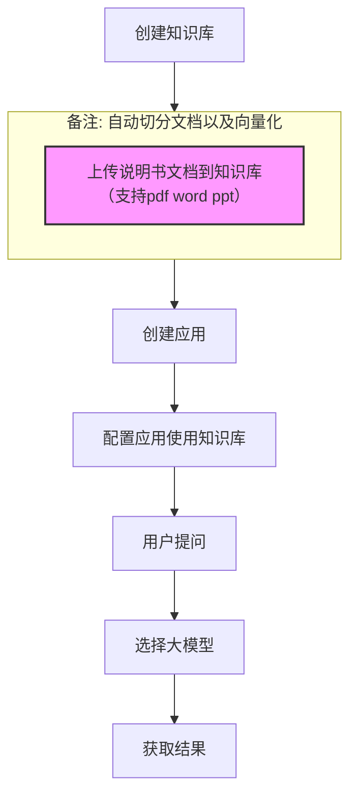

## 阿里云百炼平台

### 功能介绍

### 支持的文档格式(多模态)
```
.pdf .doc .docx .txt .md .pptx .ppt .png .jpg .jpeg .bmp .gif .xls .xlsx
```

### 使用文档地址

[百炼知识库](https://bailian.console.aliyun.com/cn-beijing?spm=5176.12818093_47.console-base_product-drawer-right.dproducts-and-services-sfm.3be916d0TFccNR&tab=doc#/doc/?type=app&url=2807740)

### 流程




## 字节火山方舟

### 功能介绍

### 支持的文档格式

#### 多模态
```
.mp4 .pdf .ppt .txt .markdown .doc .xlsx .csv .json .faq
```
#### 结构化
```
.csv .xlsx .json .faq .xlsx
```

### 使用文档地址

[火山方舟知识库](https://www.volcengine.com/docs/84313/1254463?lang=zh)

[火山方舟知识库检索api](https://www.volcengine.com/docs/84313/1544072?lang=zh)

### 流程

与上面相似，没有自建应用，直接调用api即可


## 腾讯混元

### 功能介绍

### 支持的文档格式
```
.pdf .doc .docx .xls.xlsx .ppt .pptx .md .txt .png .jpg .jpeg .csv
```

### 使用文档地址

[上传文档](https://cloud.tencent.com/document/product/1772/115348#6.-.E9.94.99.E8.AF.AF.E7.A0.81)
[检索文档](https://cloud.tencent.com/document/product/1772/115349)
### 流程

同上


## [[横向对比（综合推荐阿里云百炼）]]

