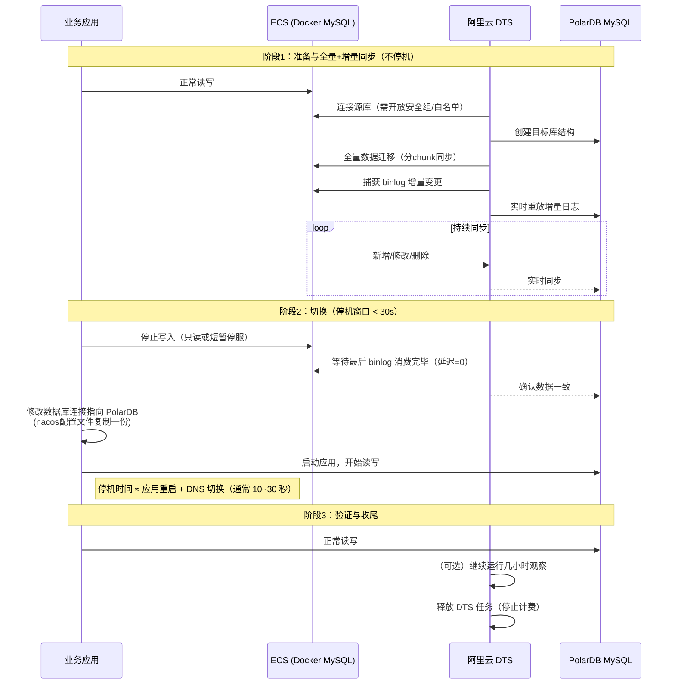

## 数据迁移流程



---
## 数据迁移配置相关

参考阿里云给的注意事项

[自建MySQL上PolarDB限制条件](https://help.aliyun.com/zh/polardb/polardb-for-mysql/user-guide/migrate-data-from-a-self-managed-mysql-database-to-a-polardb-for-mysql-cluster?spm=a2c4g.11186623.help-menu-2249963.d_5_2_2_0.e24f59f2iQDZAK\&scm=20140722.H_345638._.OR_help-T_cn\~zh-V_1)

### 数据库规格

#### 容量计算

对数据的大小进行评估

```sql
-- 数据大小查询
-- 整库大小
SELECT 
    CONCAT(ROUND(SUM(data_length + index_length) / 1024 / 1024, 2), ' MB') AS total_size_mb,
    CONCAT(ROUND(SUM(data_length + index_length) / 1024 / 1024 / 1024, 2), ' GB') AS total_size_gb
FROM information_schema.TABLES;

```

3306

| total\_size\_mb | total\_size\_gb |
| :-------------- | :-------------- |
| 40520.58 MB     | 39.57 GB        |

3308

| total\_size\_mb | total\_size\_gb |
| :-------------- | :-------------- |
| 6440.78 MB      | 6.29 GB         |

```sql
 -- 非系统表数据大小
SELECT CONCAT(ROUND(SUM(data_length + index_length) / 1024 / 1024, 2), 'MB') AS total_user_data_mb,CONCAT(ROUND(SUM(data_length + index_length) / 1024 / 1024 / 1024, 2), ' GB') AS total_user_data_gb FROM information_schema.TABLES WHERE table_schema NOT IN ('mysql', 'information_schema', 'performance_schema', 'sys');
```

3306

| total\_size\_mb | total\_size\_gb |
| :-------------- | :-------------- |
| 40511.32 MB     | 39.56 GB        |

3308

| total\_size\_mb | total\_size\_gb |
| :-------------- | :-------------- |
| 6432.88 MB      | 6.28 GB         |
```sql
-- 各个schema数据大小
SELECT table_schema AS database_name,CONCAT(ROUND(SUM(data_length + index_length) / 1024 / 1024, 2), ' MB') AS size_mb,CONCAT(ROUND(SUM(data_length + index_length) / 1024 / 1024 / 1024, 2), ' GB') AS size_gb FROM information_schema.TABLES WHERE table_schema NOT IN ('mysql', 'information_schema', 'performance_schema', 'sys') GROUP BY table_schema
ORDER BY SUM(data_length + index_length) DESC;
```

3306

| database\_name       | size\_mb    | size\_gb |
| :------------------- | :---------- | :------- |
| erp                  | 19953.61 MB | 19.49 GB |
| atoto-data-sync      | 11217.98 MB | 10.96 GB |
| atoto                | 5610.69 MB  | 5.48 GB  |
| flowable             | 1563.56 MB  | 1.53 GB  |
| atoto-user           | 1023.47 MB  | 1.00 GB  |
| xxl\_job             | 585.45 MB   | 0.57 GB  |
| atoto-pricing-system | 257.20 MB   | 0.25 GB  |
| knowledge\_chat      | 247.67 MB   | 0.24 GB  |
| WordPressDB          | 19.66 MB    | 0.02 GB  |
| software\_upgrade    | 13.33 MB    | 0.01 GB  |
| atoto-file-center    | 13.27 MB    | 0.01 GB  |
| atoto-point          | 4.58 MB     | 0.00 GB  |
| nacos                | 0.58 MB     | 0.00 GB  |
| mall-index           | 0.17 MB     | 0.00 GB  |
| tmp\_join            | 0.09 MB     | 0.00 GB  |

3308

| database\_name | size\_mb   | size\_gb |
| :------------- | :--------- | :------- |
| traccar        | 4125.20 MB | 4.03 GB  |
| atoto-gps-core | 2307.67 MB | 2.25 GB  |

#### 迁移带宽计算

源库(所在ECS)出口带宽限制 如果走公网则需要计算公网带宽对速率的影响

如果走VPC内网则需要查看和计算源ECS VPC内网带宽


    内网带宽不是问题


### 数据配置

#### 参数配置

```sql
-- binlog相关配置  查询 生产binlog保留3天 测服binlog保留30天 其他配置完全一样 且支持
show VARIABLES like '%log_bin%';
```

3306

| Variable\_name                      | Value                       |
| :---------------------------------- | :-------------------------- |
| log\_bin                            | ON                          |
| log\_bin\_basename                  | /var/lib/mysql/binlog       |
| log\_bin\_index                     | /var/lib/mysql/binlog.index |
| log\_bin\_trust\_function\_creators | ON                          |
| log\_bin\_use\_v1\_row\_events      | OFF                         |
| sql\_log\_bin                       | ON                          |

3308

**与上面相同**

| Variable\_name                      | Value                       |
| :---------------------------------- | :-------------------------- |
| log\_bin                            | ON                          |
| log\_bin\_basename                  | /var/lib/mysql/binlog       |
| log\_bin\_index                     | /var/lib/mysql/binlog.index |
| log\_bin\_trust\_function\_creators | ON                          |
| log\_bin\_use\_v1\_row\_events      | OFF                         |
| sql\_log\_bin                       | ON                          |

```sql
show VARIABLES like '%binlog%';
```

3306

| Variable\_name                                       | Value                |
| ---------------------------------------------------- | -------------------- |
| binlog\_cache\_size                                  | 32768                |
| binlog\_checksum                                     | CRC32                |
| binlog\_direct\_non\_transactional\_updates          | OFF                  |
| binlog\_encryption                                   | OFF                  |
| binlog\_error\_action                                | ABORT\_SERVER        |
| binlog\_expire\_logs\_seconds                        | **259200**           |
| binlog\_format                                       | ROW                  |
| binlog\_group\_commit\_sync\_delay                   | 0                    |
| binlog\_group\_commit\_sync\_no\_delay\_count        | 0                    |
| binlog\_gtid\_simple\_recovery                       | ON                   |
| binlog\_max\_flush\_queue\_time                      | 0                    |
| binlog\_order\_commits                               | ON                   |
| binlog\_rotate\_encryption\_master\_key\_at\_startup | OFF                  |
| binlog\_row\_event\_max\_size                        | 8192                 |
| binlog\_row\_image                                   | FULL                 |
| binlog\_row\_metadata                                | MINIMAL              |
| binlog\_row\_value\_options                          |                      |
| binlog\_rows\_query\_log\_events                     | OFF                  |
| binlog\_stmt\_cache\_size                            | 32768                |
| binlog\_transaction\_compression                     | OFF                  |
| binlog\_transaction\_compression\_level\_zstd        | 3                    |
| binlog\_transaction\_dependency\_history\_size       | 25000                |
| binlog\_transaction\_dependency\_tracking            | COMMIT\_ORDER        |
| innodb\_api\_enable\_binlog                          | OFF                  |
| log\_statements\_unsafe\_for\_binlog                 | ON                   |
| max\_binlog\_cache\_size                             | 18446744073709547520 |
| max\_binlog\_size                                    | 1073741824           |
| max\_binlog\_stmt\_cache\_size                       | 18446744073709547520 |
| sync\_binlog                                         | 1                    |

3308

| Variable\_name                                       | Value                |
| :--------------------------------------------------- | :------------------- |
| binlog\_cache\_size                                  | 32768                |
| binlog\_checksum                                     | CRC32                |
| binlog\_direct\_non\_transactional\_updates          | OFF                  |
| binlog\_encryption                                   | OFF                  |
| binlog\_error\_action                                | ABORT\_SERVER        |
| binlog\_expire\_logs\_seconds                        | **2592000**          |
| **binlog\_format**                                   | ROW                  |
| binlog\_group\_commit\_sync\_delay                   | 0                    |
| binlog\_group\_commit\_sync\_no\_delay\_count        | 0                    |
| binlog\_gtid\_simple\_recovery                       | ON                   |
| binlog\_max\_flush\_queue\_time                      | 0                    |
| binlog\_order\_commits                               | ON                   |
| binlog\_rotate\_encryption\_master\_key\_at\_startup | OFF                  |
| binlog\_row\_event\_max\_size                        | 8192                 |
| **binlog\_row\_image**                               | FULL                 |
| binlog\_row\_metadata                                | MINIMAL              |
| binlog\_row\_value\_options                          |                      |
| binlog\_rows\_query\_log\_events                     | OFF                  |
| binlog\_stmt\_cache\_size                            | 32768                |
| binlog\_transaction\_compression                     | OFF                  |
| binlog\_transaction\_compression\_level\_zstd        | 3                    |
| binlog\_transaction\_dependency\_history\_size       | 25000                |
| binlog\_transaction\_dependency\_tracking            | COMMIT\_ORDER        |
| innodb\_api\_enable\_binlog                          | OFF                  |
| log\_statements\_unsafe\_for\_binlog                 | ON                   |
| max\_binlog\_cache\_size                             | 18446744073709547520 |
| max\_binlog\_size                                    | 1073741824           |
| max\_binlog\_stmt\_cache\_size                       | 18446744073709547520 |
| sync\_binlog                                         | 1                    |

```sql
show VARIABLES like '%server_id%';
-------
结果：
1
```

***这是DTS需要的配置***

| **参数**                        | **源库** | **目标库(目标库建议跟随源库)** | **是否动态（Dynamic）** | **备注**           |
| ----------------------------- | ------ | ------------------ | :---------------- | ---------------- |
| log\_bin                      | ON     | ON                 | NO                | 版本8以下值为mysql-bin |
| binlog\_format                | row    | row                | NO                |                  |
| binlog\_row\_image            | full   | full               | NO                |                  |
| expire\_logs\_days            |        |                    |                   |                  |
| binlog\_expire\_logs\_seconds |        |                    |                   |                  |

#### 数据库编码设置

建议设置成统一的数据库编码 utf8\_mb4\_general\_ci（可选）

如果有特殊要求可对特殊列制定

### 表结构限制

#### 所有的表必须有主键，如果没有酌情考虑


```sql
## 没有主键的表
SELECT 
	t.TABLE_SCHEMA,
	t.TABLE_NAME
FROM 
	INFORMATION_SCHEMA.TABLES t
LEFT JOIN 
	INFORMATION_SCHEMA.KEY_COLUMN_USAGE kcu 
	ON t.TABLE_SCHEMA = kcu.TABLE_SCHEMA
	AND t.TABLE_NAME = kcu.TABLE_NAME
	AND kcu.CONSTRAINT_NAME = 'PRIMARY'
WHERE 
	t.TABLE_TYPE = 'BASE TABLE'
	AND t.TABLE_SCHEMA NOT IN ('mysql', 'information_schema', 'performance_schema', 'sys')
	AND kcu.TABLE_NAME IS NULL
ORDER BY 
	t.TABLE_SCHEMA, t.TABLE_NAME;
```

#### 所有的表的隐藏列必须设置可见(MySQL8.0.23及以上需设置)
```sql
-- 查询隐藏列  mysql8.0.23及以上需要注意 我们的测服没有
SELECT 
	TABLE_SCHEMA,
	TABLE_NAME,
	COLUMN_NAME,
	ORDINAL_POSITION,
	COLUMN_DEFAULT,
	IS_NULLABLE,
	DATA_TYPE,
	EXTRA
FROM INFORMATION_SCHEMA.COLUMNS
WHERE 
	TABLE_SCHEMA NOT IN ('mysql', 'information_schema', 'performance_schema', 'sys')
	AND EXTRA LIKE '%INVISIBLE%';
```

3306

| TABLE\_SCHEMA        | TABLE\_NAME                                             |
| :------------------- | :------------------------------------------------------ |
| atoto                | sa\_member\_detail20221015                              |
| atoto                | t\_mall\_pricing\_2                                     |
| atoto                | t\_product\_sku\_cost\_log                              |
| atoto                | t\_shopify\_clearance\_config                           |
| atoto                | t\_shopify\_refund\_order\_transaction\_r               |
| atoto                | t\_shopify\_return\_exchange\_line\_item\_line\_item\_r |
| atoto                | t\_sku\_mmn\_relation\_area                             |
| atoto                | t\_sku\_mmn\_relation\_log                              |
| atoto-pricing-system | atoto\_freight\_relate\_area                            |
| atoto-user           | sa\_member\_detai20221015                               |
| atoto-user           | sa\_member\_detail                                      |
| atoto-user           | sa\_member\_detail202207                                |
| atoto-user           | sa\_member\_detail20221025                              |
| atoto-user           | sa\_member\_detail20221202                              |
| atoto-user           | sa\_member\_detail20221205                              |
| atoto-user           | sa\_member\_detail20221209                              |
| atoto-user           | sa\_member\_detail20221214                              |
| atoto-user           | t\_customer\_shopify\_r                                 |
| flowable             | ACT\_ADM\_DATABASECHANGELOG                             |
| flowable             | ACT\_APP\_DATABASECHANGELOG                             |
| flowable             | ACT\_CMMN\_DATABASECHANGELOG                            |
| flowable             | ACT\_CO\_DATABASECHANGELOG                              |
| flowable             | ACT\_DE\_DATABASECHANGELOG                              |
| flowable             | ACT\_DMN\_DATABASECHANGELOG                             |
| flowable             | ACT\_FO\_DATABASECHANGELOG                              |
| flowable             | FLW\_EV\_DATABASECHANGELOG                              |
| nacos                | permissions                                             |
| nacos                | roles                                                   |
| software\_upgrade    | undo\_log                                               |
| tmp\_join            | user\_devices\_tmp                                      |

3308

| TABLE\_SCHEMA | TABLE\_NAME              |
| :------------ | :----------------------- |
| traccar       | DATABASECHANGELOG        |
| traccar       | tc\_device\_attribute    |
| traccar       | tc\_device\_command      |
| traccar       | tc\_device\_driver       |
| traccar       | tc\_device\_geofence     |
| traccar       | tc\_device\_maintenance  |
| traccar       | tc\_device\_notification |
| traccar       | tc\_device\_order        |
| traccar       | tc\_group\_attribute     |
| traccar       | tc\_group\_command       |
| traccar       | tc\_group\_driver        |
| traccar       | tc\_group\_geofence      |
| traccar       | tc\_group\_maintenance   |
| traccar       | tc\_group\_notification  |
| traccar       | tc\_group\_order         |
| traccar       | tc\_user\_attribute      |
| traccar       | tc\_user\_calendar       |
| traccar       | tc\_user\_command        |
| traccar       | tc\_user\_device         |
| traccar       | tc\_user\_driver         |
| traccar       | tc\_user\_geofence       |
| traccar       | tc\_user\_group          |
| traccar       | tc\_user\_maintenance    |
| traccar       | tc\_user\_notification   |
| traccar       | tc\_user\_order          |
| traccar       | tc\_user\_user           |

#### 是否有update时更新时间戳（可选操作）

```sql
-- 是否列含有 更新时间戳的
SELECT
  TABLE_SCHEMA,
  TABLE_NAME,
  DATA_TYPE,
  IS_NULLABLE,
  COLUMN_DEFAULT,
  EXTRA
FROM
  INFORMATION_SCHEMA.COLUMNS
WHERE
  table_schema NOT IN ('mysql', 'information_schema', 'performance_schema', 'sys')
  AND ( -- MySQL 8.0+ 可能显示为 'DEFAULT_GENERATED on update CURRENT_TIMESTAMP'
	EXTRA LIKE '%on update CURRENT_TIMESTAMP%' OR -- 兼容旧版本
	(COLUMN_DEFAULT = 'CURRENT_TIMESTAMP' AND EXTRA = 'on update CURRENT_TIMESTAMP'));
```

